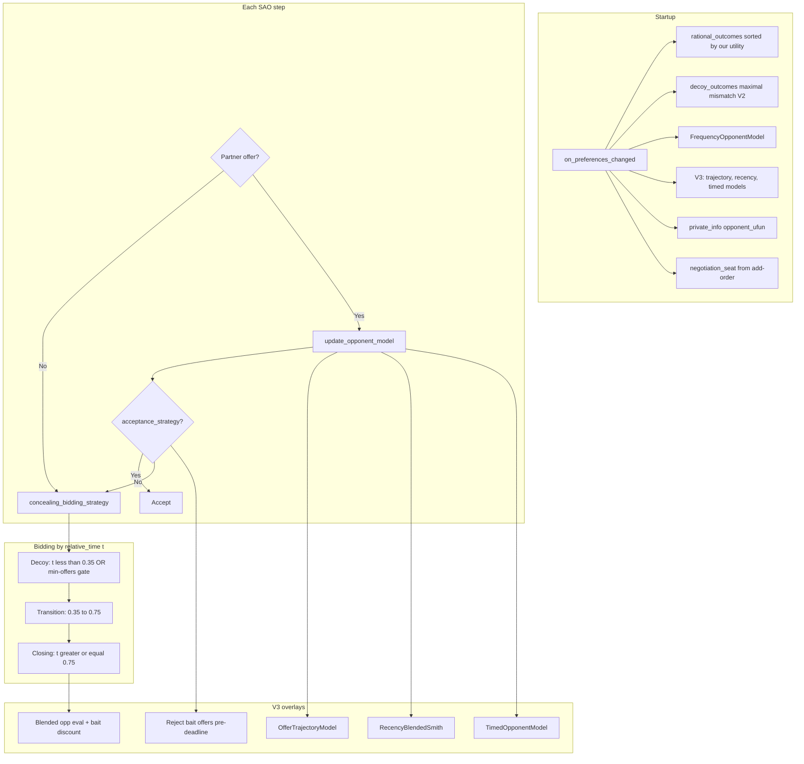

# Agent360 — Complete Submission Strategy (ANL 2026)

**Submitted agent:** `Agent360` in module `agent360`  
**Source in repo:** `agent360_submit.py` (packaged as `agent360.py` inside `submitted.zip`)  
**Dependencies:** `negmas>=0.15.4` (`requirements.txt`)  
**Negotiation protocol:** Bilateral SAO (Stackelberg alternating offers) via NegMAS `SAOCallNegotiator`

This document describes **everything** about our submitted agent: competition goals, design evolution, bidding tactics, opponent modeling, constants, evaluation, and rejected alternatives. It is written to stand alone as a report reference.

**Related docs:** [agent360-v2.4-strategy.md](agent360-v2.4-strategy.md) (V2.4 deep dive), [agent360-v3-plan.md](agent360-v3-plan.md) (V3 development plan), [evaluation.md](evaluation.md), [weekend-progress-summary.md](weekend-progress-summary.md)

---

## Table of contents

1. [Executive summary](#1-executive-summary)
2. [Competition scoring](#2-competition-scoring)
3. [Design philosophy](#3-design-philosophy)
4. [Evolution: V1 → V2.4 → V3](#4-evolution-v1--v24--v3)
5. [Architecture](#5-architecture)
6. [Our three concealment tactics](#6-our-three-concealment-tactics)
7. [Opponent threat model](#7-opponent-threat-model)
8. [Startup: preference initialization](#8-startup-preference-initialization)
9. [Three-phase bidding persona](#9-three-phase-bidding-persona)
10. [V2.4 concealment layer](#10-v24-concealment-layer)
11. [V3 opponent intelligence layer](#11-v3-opponent-intelligence-layer)
12. [Opponent profiling modes](#12-opponent-profiling-modes)
13. [Acceptance strategy](#13-acceptance-strategy)
14. [Published opponent model (`opponent_ufun`)](#14-published-opponent-model-opponent_ufun)
15. [Main loop per negotiation step](#15-main-loop-per-negotiation-step)
16. [Constants reference](#16-constants-reference)
17. [Design constraints](#17-design-constraints)
18. [Variants we did not submit](#18-variants-we-did-not-submit)
19. [Evaluation and benchmarks](#19-evaluation-and-benchmarks)
20. [Submission packaging](#20-submission-packaging)
21. [Limitations and known weak matchups](#21-limitations-and-known-weak-matchups)
22. [Debugging and reproduction](#22-debugging-and-reproduction)

---

## 1. Executive summary

**Agent360** is a **concealment-first bilateral negotiator** for ANL 2026. It maximizes:

$$\text{Score} = \text{Advantage} + \text{Concealing}$$

| Goal | How we achieve it |
|------|-------------------|
| **Concealing** | A **decoy persona**: early bids misrepresent which issues we care about; gradual transition; late bait-and-switch closing bids. Opponents’ Smith/frequency learners fit the wrong curve. |
| **Advantage** | Time-decaying aspiration, accept-if-we-would-bid-worse (AC-next), Smith-based closing bids — upgraded in V3 with **deception-aware** opponent modeling. |

The submitted agent is **V3 logic with V2.4 bid stream unchanged**:

- **Persona (what we bid):** V2.4 — maximal-mismatch decoy pool, first-seat min-offer gate, first-seat decoy rotation.
- **Brain (how we model them):** V3 — trajectory tracking, late/recency/issue-weighted Smith, bait detection, opponent mode profiling.

We explicitly **rejected** truth-first (Reverse) and abrupt full-flip decoy strategies: they win raw deal quality against some opponents but **collapse Concealing** when opponents learn our preferences (~0.42–0.66 vs learners).

---

## 2. Competition scoring

Implemented in `main.calc_scores` (matches organizer rules):

| Metric | Definition |
|--------|------------|
| **Advantage** | `utility(agreement) − reserved_value` for our agent |
| **Concealing** | Share of one normalized point based on how **poorly the opponent modeled our true utility**. Computed from Kendall agreement between their published `opponent_ufun` and our real `ufun`, zero-sum between negotiators. |
| **Score** | Advantage + Concealing |

**Implications for design:**

1. **Our bid stream** is the primary Concealing lever — we must mislead *their* learner, not only improve *our* model.
2. **Our published `opponent_ufun`** affects Advantage (better closing/acceptance) and indirectly Concealing (if we model them well, they may model us worse relative share).
3. We never use oracle access to opponent true preferences — only offers observed in the negotiation.

---

## 3. Design philosophy

### 3.1 Separate concerns

| Layer | Question it answers | Must not break |
|-------|---------------------|----------------|
| **Concealment persona** | “What should we *show* the opponent?” | Stable decoy → transition → closing bid pattern |
| **Opponent model** | “What do they *actually* want, given deception?” | Learner-safe fallbacks when no deception signals |
| **Acceptance** | “Is this offer a trap or a good deal?” | Deadline safety (`t > 0.92`) |

V3 changes **modeling and acceptance/closing evaluation**; it does **not** change phase boundaries or decoy pool construction (beyond rotation when first seat).

### 3.2 No opponent-type routing

We **never** classify the opponent by name/class at runtime and switch to a hard-coded strategy profile. Adaptation uses **observable signals only**:

- Seat (first vs second proposer) — from mechanism add-order.
- Offer history patterns — decoy flips, trajectory slope, Smith concentration, mirror matching.

This keeps the agent defensible under competition rules and avoids overfitting to sparring class names.

### 3.3 Empirical promotion

Every major idea (min-offer gate, decoy rotation, V2.5 soft transition, Reverse, Full flip, V3 bait guards) was benchmarked on:

- **Deceptive sparring panel** (2024-style lite opponents with decoy+bait enabled).
- **Learner panel** (BOA, MAP, MiCRO).
- **Stress panel** (NegMAS time-based / behavioral baselines).

Promotion metric: **sparring mean Score excluding Mirror** (Mirror is self-play diagnostic, not a tournament opponent).

---

## 4. Evolution: V1 → V2.4 → V3

| Version | Class (dev) | Submission | Main idea |
|---------|-------------|------------|-----------|
| **V1 gradient** | `Agent360Base` | — | Phased decoy → transition → closing; moderate decoy pool (≥ n/3 issue mismatch) |
| **V2.3** | `Agent360V2` | — | **Maximal-mismatch decoy pool** (≥ half of issues wrong vs true top outcomes) |
| **V2.4** | `Agent360V2` | — | **First-seat min-offer gate** — stay in decoy until opponent has bid 3 times |
| **V3** | `Agent360V3` | **`Agent360`** | V2.4 persona + **anti-deception opponent model** |

**Submitted file** (`agent360_submit.py`) inlines all layers as one self-contained module:

```
FrequencyOpponentModel
Agent360Base      ← V1 phased engine
Agent360V2        ← V2.4 decoy persona
[ V3 helper classes ]
Agent360          ← submission class (V3 on V2.4)
```

---

## 5. Architecture



| Method | Role |
|--------|------|
| `on_preferences_changed` | Build outcome pools, init models, record seat, publish `opponent_ufun` |
| `__call__` | Main SAO loop: accept or counter |
| `concealing_bidding_strategy` | Phase-based next bid (Concealing) |
| `acceptance_strategy` | Aspiration + AC-next + deadline + V3 bait guard |
| `update_opponent_model` | Smith counts + V3 trajectory/recency/timed records |
| `estimated_opponent_utility` | Used in closing; V3 applies bait discount when deceptive |

---

## 6. Our three concealment tactics

We assume competitive ANL entries use the same fundamental toolkit we do. Our agent **implements** these tactics and **defends** against them in V3.

### Tactic 1 — Decoy persona (early misdirection)

**What we do:** In the decoy phase, bid outcomes from `decoy_outcomes` that are **rational for us** but signal **wrong issue priorities** (maximal mismatch vs our true top outcomes).

**Why it works:** Smith and curve-fit learners infer issue weights from early bids. Wrong early signal → wrong `opponent_ufun` for us → high Concealing.

**V2.4 addition:** When **first seat**, remain in decoy until the opponent has made **3 offers**, even after `t ≥ 0.35`. Prevents solo-stream curve-fit (RentingLite-style).

**V3 addition:** When **first seat**, **rotate** decoys — do not repeat any of the last 5 own decoy bids. Harder to fit a smooth utility-vs-time curve.

### Tactic 2 — Bait-and-switch (transition / closing spike)

**What we do:** In transition, gradually mix true aspiration band with decoy pool until 60% transition progress. In closing, weight opponent Smith estimate when picking bids — offer outcomes that look **great to them** on frequency model while keeping enough utility for us.

**What we defend (V3):** Opponents may spike Smith-estimated utility mid-negotiation without matching their **concession trajectory** — a bait offer designed to make us accept or concede on wrong issues. V3 detects this and discounts such offers in closing and rejects before deadline in acceptance.

### Tactic 3 — Smith learning (frequency opponent model)

**What we do:** Expose `opponent_ufun` via standard Smith counts; use it in closing.

**What we defend:** Distinguish **plain learners** (BOA/MAP — high repetition, monotone trajectory) from **deceptive** agents (decoy flips, non-monotone utility, late issue switches). Bait logic applies only to deceptive profile.

---

## 7. Opponent threat model

| Opponent style | Example | Primary threat | Our response |
|----------------|---------|----------------|--------------|
| **Smith learner** | BOA, MAP, MiCRO, LearnerStrong | Learns our persona from bids | Decoy + min-offers + rotation; don’t trigger bait discount |
| **Curve-fit learner** | RentingLite | Fits `(t, u)` from our solo opening stream | Min-offer gate; decoy rotation |
| **Rational filter** | UOAgentLite | Filters noise issues, tracks RV | Issue-weighted late Smith; stable issue blend |
| **Time-based** | Boulware, Conceder | Predictable concession | Trajectory slope → conceding mode; trust Smith more |
| **Deceptive competitor** | Shochan/UO/Renting with decoy+bait | False Smith signal | Trajectory + bait guards + late-weighted model |
| **Mirror** | Self-play V2 | Identical strategy | Mirror detection → plain Smith (diagnostic only) |

We **do not** assume all opponents are deceptive. Default mode after few samples is **learner** — conservative for BOA/MAP.

---

## 8. Startup: preference initialization

On `on_preferences_changed`:

1. **Record seat** — `negotiation_seat` from mechanism negotiator list index (0 = first proposer).

2. **Build `rational_outcomes`** — all outcomes above reservation, sorted **best-for-us first**.

3. **Build `decoy_outcomes`** — see [§10.1](#101-maximal-mismatch-decoy-pool).

4. **Initialize Smith model** — `FrequencyOpponentModel(num_issues)`.

5. **V3 models** — `OfferTrajectoryModel`, `RecencyBlendedSmith`, `TimedOpponentModel`.

6. **Publish opponent model** — `private_info["opponent_ufun"] = LambdaMultiFun(f=_published_opponent_utility)` using V3 **blended** estimate (not raw Smith).

---

## 9. Three-phase bidding persona

Phases use **relative time** `t ∈ [0, 1]` (0 = start, 1 = deadline).

| Phase | Time window | Behavior |
|-------|-------------|----------|
| **Decoy** | `t < 0.35` **or** first-seat min-offer gate active | Bid from decoy pool (random or rotated) |
| **Transition** | `0.35 ≤ t < 0.75` | Mix decoy + true aspiration band; utility floor drops with progress |
| **Closing** | `t ≥ 0.75` | Pick bid maximizing blended score: our utility + estimated opponent utility |

Randomness: `random.Random(hash((self.id, state.step)) & 0xFFFFFFFF)` — reproducible per step.

### 9.1 Transition details

- Utility band floor: `max_u × (0.92 − 0.35 × transition_progress)`.
- Until `transition_progress < 0.6`, inject decoy outcomes into candidate pool (decoy mix).
- `transition_progress` scaled by `transition_progress_scale()` (1.0 in submission).

### 9.2 Closing details (base)

- Minimum our utility ramps from **72%** to **52%** of max through closing phase.
- Opponent weight `w` ramps: `0.15 + 0.35 × (t − 0.75)` capped at **0.45** (V3 may reduce cap vs deceptive opponents).
- Sample up to 40 candidates; maximize:
  `(1 − w) × (my_u / max_u) + w × estimated_opponent_utility(offer)`
- V3’s `estimated_opponent_utility` may **discount bait** offers when deceptive signals present.

---

## 10. V2.4 concealment layer

### 10.1 Maximal-mismatch decoy pool

Algorithm in `Agent360V2._build_decoy_pool`:

1. From top ~10% rational outcomes (min 3, max 30), infer **true preferred value per issue** (mode per issue).
2. Scan rational outcomes above utility floor: `max(RV, 55% × utility of weakest top-tier outcome)`.
3. Score each outcome by **count of mismatched issues** vs true preferences.
4. Keep outcomes with mismatch ≥ `⌈n_issues / 2⌉`.
5. Keep only **maximum** mismatch tier; if &lt; 3 outcomes, include near-max (−1 mismatch).

**Intent:** bids are good for us but lie about **which issues matter** — stronger misdirection than V1’s “≥ n/3 mismatch” pool.

### 10.2 First-seat min-offer gate

```text
transition_allowed() =
  True   if second seat OR FIRST_MIN_OPPONENT_OFFERS <= 0
  True   if _opponent_offer_count >= 3
  False  otherwise
```

While `transition_allowed()` is False, `_in_decoy_phase()` stays True even when `t ≥ 0.35`.

| Seat | Decoy end (time) | Min opponent offers before transition |
|------|------------------|--------------------------------------|
| First (0) | 0.35 (extendable by gate) | **3** |
| Second (1) | 0.35 | 0 (gate disabled) |

**Motivation:** RentingLite and similar agents fit a curve to **our** bids alone when we open; delaying transition until they have bid forces their model to use **their** signal too.

### 10.3 First-seat decoy rotation (V3)

When opening and we have bid history:

- Avoid repeating any outcome in the last **5** own decoy bids.
- Pick uniformly from remaining decoy pool; fallback to full pool if exhausted.

**Motivation:** Breaks smooth curve-fit on `(t, u_self)` without changing decoy pool composition.

---

## 11. V3 opponent intelligence layer

V3 assumes rivals use [the three tactics in §6](#6-our-three-concealment-tactics). Modeling upgrades apply to **closing**, **acceptance**, and **published `opponent_ufun`** — not to decoy pool construction.

### 11.1 FrequencyOpponentModel (Smith baseline)

Per issue, count how often opponent uses each value. For offer evaluation:

```text
score(issue i) = count(value) / max_count_on_issue_i
opp_smith(offer) = mean(score(i)) across issues
```

Standard BOA/MAP building block. Used as the **base layer** for all blended estimates.

### 11.2 TimedOpponentModel (late-phase weighting)

Records `(relative_time, offer)` for every opponent bid.

- Bids with `t ≥ 0.40` (`LATE_TIME_THRESHOLD`) counted **3×** (`LATE_BID_WEIGHT`) when building effective Smith counts.
- **`late_phase_estimated(offer)`** — Smith on late bids only (≥ 2 late offers required).
- **`late_issue_weighted_estimated(offer)`** — issue-weighted Smith on late bids (see below).

**Intent:** Opponent decoy phase is roughly `t ≲ 0.38` (2024-style agents). Down-weight early noise; up-weight post-decoy signal.

### 11.3 RecencyBlendedSmith

Maintains window of last **5** opponent offers. Blends full Smith with window-only Smith:

```text
weight = min(0.68, 0.22 + 0.09 × n_recent)
blended = (1 − weight) × full_smith + weight × recent_smith
```

Applied when **second seat** and enough recent samples — reacts to opponent’s latest persona shift.

### 11.4 Issue-weighted Smith estimate

For a list of offers (typically late phase):

- Issues where opponent **repeats one value** (low spread) → **low weight** (likely decoy/noise).
- Issues with **distinct values** and lower concentration → **high weight** (real negotiation).

Matches rational-filter behavior (UOAgent-style): focus on issues they actually fight over.

### 11.5 OfferTrajectoryModel

Records `(t, smith_u)` each time opponent bids, where `smith_u` is Smith estimate **at that moment**.

| Method | Purpose |
|--------|---------|
| `concession_slope()` | Linear slope of Smith utility vs time — negative ≈ conceding |
| `predicted_utility_at(t)` | Extrapolate expected Smith utility at time t |
| `is_non_monotone()` | ≥ 2 significant utility **rises** → possible bait/decoy |
| `inconsistency_vs_trajectory(u, t)` | `|u − predicted(t)|` — bluff magnitude |

**Honest concession** threshold: slope ≤ **−0.04** (`HONEST_CONCESSION_SLOPE`).

### 11.6 Blended opponent utility (`_blended_opponent_utility`)

Core estimate for published model and closing (before bait discount):

1. Start with full Smith.
2. If ≥ 2 late timed samples: blend toward `late_phase_estimated` (weight up to 0.55 second seat / 0.62 first seat).
3. If ≥ 3 late offers: blend toward issue-weighted late estimate (up to 0.28).
4. If **second seat** and ≥ 2 recent offers: blend toward recency Smith (up to 0.55).
5. If mode is learner/conceding/unknown and ≥ 3 recent: blend **stable issue match** (0.14) — match values opponent repeated recently.

**Mirror override:** if opponent copies our last bids (≥ 3 matches in window of 4), use plain Smith only.

### 11.7 Bait detection and discount

**When bait logic applies** (`_should_apply_bait_discount`):

- Closing phase with ≥ 3 trajectory samples.
- Opponent mode == **deceptive**.
- `_opponent_shows_concealment_tactics()` True.
- **Not** classified as plain Smith learner.

**Offer looks like bait** if:

- Smith estimate **>** trajectory prediction + **0.10** (`BAIT_THRESHOLD`), and
- Trajectory slope not conceding faster than honest threshold.

**Discount:** pull estimate toward trajectory prediction; reduce excess above threshold by **45%** (`BAIT_DISCOUNT`). Large inconsistency triggers additional blend toward prediction (0.38).

**Acceptance bait guard** (`_partner_offer_looks_like_bait`):

- Same deceptive + concealment checks.
- Reject if Smith >> trajectory + **0.08** (`ACCEPT_BAIT_THRESHOLD`) **before** `t > 0.92`.
- After `t > 0.92` (`ACCEPT_DEADLINE_SAFE`), accept normally — avoid timeout.

### 11.8 Closing weight cap adjustment

| Opponent mode | Closing opponent-weight cap |
|---------------|----------------------------|
| **conceding** | × 1.12 (cap 0.52) — chase agreement |
| **deceptive** | × 0.88 (floor 0.28) — don’t chase bait |
| other | base cap 0.45 |

---

## 12. Opponent profiling modes

`_opponent_mode()` returns one of:

| Mode | Detection (simplified) | Model behavior |
|------|------------------------|----------------|
| **mirror** | ≥ 3 identical offers in last 4 vs our bids | Plain Smith |
| **unknown** | &lt; 2 trajectory samples | Conservative learner path |
| **learner** | High issue concentration (≥ 0.78), no concealment signals | Recency + stable issue; **no bait discount** |
| **deceptive** | Early decoy persona OR non-monotone trajectory OR late bait switch | Full V3 + bait guards |
| **conceding** | Monotone trajectory, slope ≤ −0.025 | Higher closing opponent weight |

### Concealment tactic signals (`_opponent_shows_concealment_tactics`)

**Early decoy persona** (`t < 0.40` offers):

- All early offers identical, **or**
- Issue flip rate ≥ 0.25 between consecutive early offers, **or**
- Smith utility spread across early offers ≥ 0.12.

**Late bait switch** (`t ≥ 0.40`):

- Split late offers in half; preferred value per issue flips on ≥ half of issues.

**Non-monotone trajectory:** ≥ 2 utility rises in trajectory history.

Plain BOA/MAP learners typically classify as **learner**, not deceptive — important for not over-triggering bait logic.

---

## 13. Acceptance strategy

Accept partner offer if **any** condition holds:

### Base (V1/V2)

1. **Aspiration:** `u(offer) ≥ max_u × (1 − 0.55×t)` and above reserved value.
2. **AC-next:** offer utility ≥ utility of our next concealing bid (simulated).
3. **Deadline safety:** `t > 0.92` and `u(offer) > 1.02 × RV`.

### V3 overlay

After base accepts, if `t ≤ 0.92` and `_partner_offer_looks_like_bait(state)` → **reject** (counter instead).

Near deadline, bait guard disabled — always accept safe deals to avoid timeout.

---

## 14. Published opponent model (`opponent_ufun`)

The competition uses each agent’s published `opponent_ufun` to score **Concealing**.

We publish **`_published_opponent_utility` = `_blended_opponent_utility`** (V3 enriched model), **not** raw Smith.

**Why:**

- Better reflects opponent’s **late** preferences → improves our Advantage in closing.
- Competitors modeling us still use **our bids** for Concealing; our improved model doesn’t directly reduce our Concealing score.

Closing bid selection uses `estimated_opponent_utility`, which equals blended estimate **minus bait discount** when deceptive.

---

## 15. Main loop per negotiation step

```text
1. Partner offer arrives (or None if we open)
2. If offer: update_opponent_model
      - Smith counts += 1
      - V3: recency, timed, trajectory records
3. If offer and acceptance_strategy → ACCEPT
4. Else concealing_bidding_strategy → REJECT with counter
5. Record own bid in _recent_own_bids (cap 12)
```

---

## 16. Constants reference

### Phase & closing (base)

| Constant | Value | Meaning |
|----------|-------|---------|
| `DECOY_PHASE_END` | 0.35 | Decoy → transition (time) |
| `TRANSITION_PHASE_END` | 0.75 | Transition → closing |
| `TRANSITION_DECOY_MIX_UNTIL` | 0.6 | Fraction of transition mixing decoys |
| `CLOSING_MIN_UTILITY_START` | 0.72 | Closing utility floor at start |
| `CLOSING_MIN_UTILITY_END` | 0.52 | Closing utility floor at deadline |
| `CLOSING_OPPONENT_WEIGHT_BASE` | 0.15 | Initial opponent weight in closing |
| `CLOSING_OPPONENT_WEIGHT_SLOPE` | 0.35 | Opponent weight ramp |
| `CLOSING_OPPONENT_WEIGHT_CAP` | 0.45 | Max opponent weight (base) |

### V2.4 concealment

| Constant | Value | Meaning |
|----------|-------|---------|
| `FIRST_MIN_OPPONENT_OFFERS` | 3 | First-seat decoy extension |
| `FIRST_DECOY_NO_REPEAT_WINDOW` | 5 | First-seat rotation memory |

### V3 trajectory & bait

| Constant | Value | Meaning |
|----------|-------|---------|
| `MIN_TRAJECTORY_SAMPLES` | 3 | Min samples for trajectory logic |
| `HONEST_CONCESSION_SLOPE` | −0.04 | Faster = suspicious bait |
| `BAIT_THRESHOLD` | 0.10 | Smith − trajectory for closing discount |
| `BAIT_DISCOUNT` | 0.45 | Fraction of excess removed |
| `ACCEPT_BAIT_THRESHOLD` | 0.08 | Stricter threshold for acceptance |
| `ACCEPT_DEADLINE_SAFE` | 0.92 | Bait guard off after this |
| `INCONSISTENCY_BLEND_THRESHOLD` | 0.18 | Large inconsistency blend trigger |
| `INCONSISTENCY_BLEND` | 0.38 | Blend toward trajectory |

### V3 early opponent profiling

| Constant | Value | Meaning |
|----------|-------|---------|
| `LATE_TIME_THRESHOLD` | 0.40 | Decoy vs late split |
| `LATE_BID_WEIGHT` | 3 | Weight multiplier for late bids |
| `EARLY_DECOY_FLIP_RATE` | 0.25 | Early issue flip detection |
| `EARLY_DECOY_MIN_OFFERS` | 3 | Min early offers for decoy detect |
| `EARLY_SMITH_SPREAD` | 0.12 | Early utility spread detect |
| `LEARNER_CONCENTRATION` | 0.78 | Plain learner threshold |
| `LEARNER_MIN_OFFERS` | 4 | Min offers for learner classify |
| `CONCEDING_SLOPE_THRESHOLD` | −0.025 | Conceding mode slope |

### V3 blending caps

| Constant | Value | Meaning |
|----------|-------|---------|
| `RECENCY_WINDOW` | 5 | Recent offer window |
| `STABLE_ISSUE_WINDOW` | 4 | Stable preference window |
| `STABLE_ISSUE_BLEND` | 0.14 | Stable issue mix weight |
| `LATE_BLEND_MAX` | 0.55 | Max late-phase blend (second seat) |
| `FIRST_LATE_BLEND_MAX` | 0.62 | Max late-phase blend (first seat) |
| `ISSUE_WEIGHT_BLEND_MAX` | 0.28 | Max issue-weighted blend |

### Mirror detection

| Constant | Value | Meaning |
|----------|-------|---------|
| `MIRROR_MATCH_WINDOW` | 4 | Compare last N bids |
| `MIRROR_MATCH_MIN` | 3 | Matches to call mirror |

---

## 17. Design constraints

| Constraint | Rationale |
|------------|-----------|
| No oracle opponent utility | Competition rules |
| No opponent-class routing | Avoid overfit; seat-only adaptation |
| No change to decoy persona after V2.4 freeze | Concealing regressions on learners |
| Bait guards off for plain learners | BOA/MAP must not trigger false positives |
| Deadline accept always on | Avoid zero agreement |
| Self-contained submission zip | Only `agent360.py` + `requirements.txt` |

---

## 18. Variants we did not submit

| Variant | Idea | Why rejected |
|---------|------|--------------|
| **Agent360Reverse** | Truth-first early, misdirect late | High Advantage panel/H2H; Concealing ~0.42–0.66 vs learners |
| **Agent360Full** | Abrupt flip to true prefs | Unreliable vs middle gradient |
| **V2.5** | Soft transition + utility-jump decoys | Sparring −0.043 vs V2.4 |
| **V2 FirstSeat combo** | Long decoy 0.42 + min offers + rotation alone | Full combo regressed; rotation kept in V3 only |
| **V2 Adaptive** | Selfish closing when first seat | Did not beat V2.3/V2.4 mean |
| **Opponent-type routing** | Hard-coded profiles per class | Design constraint; unstable |

---

## 19. Evaluation and benchmarks

### 19.1 Local scoring

Same as competition: `main.calc_scores` after each bilateral run.

### 19.2 Panels

| Panel | Script | Opponents |
|-------|--------|-----------|
| **Deceptive sparring** | `eval_sparring.py --panel deceptive` | ShochanLite, UOAgentLite, RentingLite (+ learners optional) |
| **Learners** | `eval_sparring.py --include-learners` | BOANeg, MAPNeg, MiCRONegotiator |
| **Stress** | `eval_stress.py` | Boulware, Conceder, TitForTat, Random, Hybrid, … |
| **NegMAS baselines** | `evaluate_noamneg.py` | Tutorial + time-based NegMAS agents |

**Promotion metric:** sparring mean **Score excl. Mirror** (Mirror = self-play diagnostic).

### 19.3 Reported results (May 2026, competition proxy)

| Comparison | Result |
|------------|--------|
| **V3 vs V2.4** (excl. Mirror, 4 repeats) | **1.259 vs 1.228** (+0.031) |
| **V3 vs Reverse** (deceptive lites) | **1.263 vs 1.105** (+0.158) |
| **V3 vs V2.4** (stress panel) | **+0.009** mean Score |
| **V3 vs learners** | Score ~**1.29**, Concealing ~**0.72** |
| **V3 vs Reverse H2H** | Reverse wins (irrelevant — different Concealing trade-off) |

Canonical CSVs: `results/sparring_competition.csv`, `results/stress_v3_v2.csv`.

### 19.4 Strong matchups (examples)

- **ISBT × RentingLite, second seat:** opponent opens; our decoy stream poisons their model — Concealing ≈ 1.0.
- **Laptop × RentingLite, first seat (V2.4 fix):** Score ~1.18 vs ~0.89 before min-offer gate.

### 19.5 Weak matchups (known)

| Matchup | Issue |
|---------|-------|
| Amsterdam/Grocery × Shochan **first** | ~1.11 — opening vs strong deceptive |
| ISBT × UOAgentLite **first** | Rational filter + we open |
| Mirror **first seat** | Self-play noise — **ignore for promotion** |

---

## 20. Submission packaging

| Item | Value |
|------|-------|
| **Upload zip** | `submitted.zip` |
| **Zip contents** | `agent360.py` (from `agent360_submit.py`), `requirements.txt` |
| **Form module** | `agent360` |
| **Form class** | `Agent360` |
| **Build command** | `make_submitted_zip.bat` or `uv run python scripts/build_submission_zip.py` |

**Dev files (not in zip):**

| File | Purpose |
|------|---------|
| `agent360.py` | V1 base (`Agent360Base`) for ablations |
| `agent360_v2.py` | V2 variants and ablations |
| `agent360_v3.py` | Standalone `Agent360V3` for eval |
| `agent360_submit.py` | Self-contained submission source |

No helper modules, data files, or trained models are required — NegMAS is installed from `requirements.txt` on the server.

---

## 21. Limitations and known weak matchups

1. **First seat vs deceptive openers** — we still leak some signal before opponent bids; min-offer gate helps but doesn’t eliminate.
2. **Mirror self-play** — identical strategy → odd scores; not a tournament opponent.
3. **Non-deceptive weird agents** (Random, pure Boulware) — V3 adds little; small stress-panel gain only.
4. **Multilateral** — seat interpolation exists in ablation (`Agent360V2Adaptive`) but **not** in submission; bilateral only tuned.
5. **Bait false positives** — conservative thresholds; may miss some exploitable offers vs unknown agents.

---

## 22. Debugging and reproduction

### Tests

```bash
uv run pytest tests/test_agent360_v3.py tests/test_submission.py -q
```

### Smoke run

```bash
uv run python main.py run --scenario Camera --no-plot \
  --negotiator agent360_submit.Agent360 \
  --opponent negmas.sao.BoulwareTBNegotiator --negotiator-first
```

### Sparring benchmark

```bash
uv run python scripts/eval_sparring.py --agent v3 --panel deceptive --include-learners --repeats 4
```

### Preflight

```bash
uv run python scripts/submission_preflight.py
```

### Trace export (example)

```bash
uv run anl2026 run --scenario Laptop --no-plot \
  --negotiator agent360_submit.Agent360 \
  --opponent sparring.renting_lite.RentingLite --negotiator-first \
  --export-trace results/laptop_renting_first.csv
```

---

## Summary sentence

**Agent360** is a **V2.4 decoy-concealment negotiator** upgraded with **V3 deception-aware opponent modeling**: it misleads learners with maximal-mismatch decoys, min-offer and rotation when opening, and resists competitor bait via trajectory-based guards — optimized for ANL 2026’s **Advantage + Concealing** score against deceptive and learning opponents, not truth-first deal extraction.
