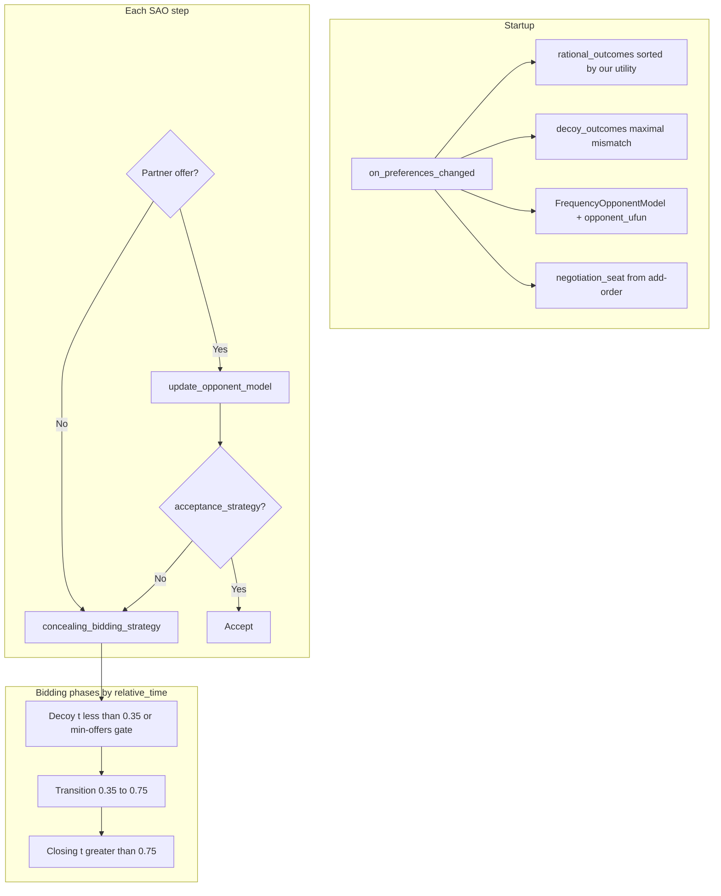

# Agent360 V2.4 — Strategy & Evaluation (Report Reference)

**Implementation:** `agent360_v2.py` → class `Agent360V2`  
**Base logic:** `agent360.py` → class `Agent360`  
**Submission path:** `agent360_v2.Agent360V2`  
**CLI / benchmarks:** `--agent v2`

This document describes the **submitted bilateral agent** for ANL 2026: design rationale, algorithms, constants,
evaluation, and experiments that led to V2.4.

**Related:
** [agent360-v3-plan.md](agent360-v3-plan.md), [sparring-and-fixes.md](sparring-and-fixes.md), [evaluation.md](evaluation.md), [decoy-strategies.md](decoy-strategies.md)

---

## 1. Executive summary

Agent360 V2.4 is a **phased concealment agent** for bilateral SAO negotiation in NegMAS. It maximizes the ANL 2026
score:

**Score = Advantage + Concealing**

| Goal           | Mechanism                                                                                       |
|----------------|-------------------------------------------------------------------------------------------------|
| **Advantage**  | Time-decaying aspiration, AC-next acceptance, Smith-based closing bids                          |
| **Concealing** | Early **decoy persona** (misleading issue priorities), gradual transition, late bait-and-switch |

V2.4 extends V2.3 with one production change: when **opening the negotiation** (seat 0), the agent **stays in the decoy
phase until the opponent has made at least three offers**, even if decoy time (35% of the deadline) has passed. This
reduces **curve-fit leaks** against opponents that infer preferences from a solo bid stream (inspired by ANL 2024
AgentRenting2024).

**Design constraint:** no runtime **opponent-type routing**. Seat detection uses mechanism add-order only (
`negotiation_seat == 0`).

---

## 2. Competition scoring (ANL 2026)

Implemented in `main.calc_scores`:

| Metric         | Definition                                                                                                                                                                                     |
|----------------|------------------------------------------------------------------------------------------------------------------------------------------------------------------------------------------------|
| **Advantage**  | `utility(agreement) − reserved_value` for our agent                                                                                                                                            |
| **Concealing** | Share of one point based on how **poorly the opponent modeled our true utility** (Kendall agreement between their `opponent_ufun` and our real `ufun`, normalized and zero-sum between agents) |
| **Score**      | Advantage + Concealing                                                                                                                                                                         |

**Implication:** we win Concealing by **misleading the opponent’s learner** with our bid stream—not by improving our own
model of them. Our Smith frequency model primarily helps **Advantage** (closing bids the opponent may accept).

---

## 3. Version lineage

| Version           | Class        | Main change                                                                   |
|-------------------|--------------|-------------------------------------------------------------------------------|
| **V1 (gradient)** | `Agent360`   | Phased decoy → transition → closing; moderate decoy pool                      |
| **V2.3**          | `Agent360V2` | **Maximal-mismatch decoy pool** (≥ half of issues wrong vs true top outcomes) |
| **V2.4**          | `Agent360V2` | **First-seat min-offer gate** (`FIRST_MIN_OPPONENT_OFFERS = 3`)               |

Variants **not** submitted: `Agent360Full` (abrupt flip), `Agent360Reverse` (truth-first), `Agent360V2Adaptive` (seat
closing), `Agent360V2_5` (soft transition + anti-curve decoys).

---

## 4. Architecture



| Method                        | Role                                                  |
|-------------------------------|-------------------------------------------------------|
| `on_preferences_changed`      | Build outcome pools, init opponent model, record seat |
| `__call__`                    | Accept or counter-offer                               |
| `concealing_bidding_strategy` | Phase-based next bid                                  |
| `acceptance_strategy`         | Aspiration + AC-next + deadline safety                |
| `update_opponent_model`       | Record opponent offers into frequency counts          |

---

## 5. Three-phase bidding strategy

Phases use **relative time** `t ∈ [0, 1]` (deadline progress).

| Phase          | Time window                      | Behavior                                                |
|----------------|----------------------------------|---------------------------------------------------------|
| **Decoy**      | `t < 0.35` (extendable — see §6) | Random bid from `decoy_outcomes`                        |
| **Transition** | `0.35 ≤ t < 0.75`                | Blend decoy pool + gradually lower true aspiration band |
| **Closing**    | `t ≥ 0.75`                       | Score candidates: `(1−w)·my_u + w·opp_est`; pick best   |

### 5.1 Decoy pool (V2.3+)

Algorithm in `Agent360V2._build_decoy_pool`:

1. From our top ~10% rational outcomes (min 3, max 30), infer **true preferred value per issue** (mode per issue).
2. Scan rational outcomes above a utility floor (≥ max( RV, 55% of top-tier utility )).
3. Keep outcomes that mismatch on **≥ ⌈n_issues / 2⌉** issues vs true preferences.
4. Keep only **maximum mismatch** count; if &lt; 3 candidates, include near-max (−1 mismatch).

**Intent:** bids are **good for us** but signal **wrong issue priorities**—harder for Smith/frequency learners than
V1’s “≥ n/3 mismatch” pool.

### 5.2 Transition

- Utility band floor: `max_u × (0.92 − 0.35 × transition_progress)`.
- Until `transition_progress < 0.6`, mix decoy outcomes into the candidate pool.

### 5.3 Closing

- Minimum our utility ramps from 72% to 52% of max through closing.
- Opponent weight `w` ramps from 0.15 toward cap 0.45.
- Sample up to 40 candidates; maximize blended score using **Smith frequency estimate** of opponent utility.

---

## 6. V2.4 first-seat rule (key submission change)

**Problem:** When we **open**, opponents like **RentingLite** (curve-fit on `(time, estimated utility)`) learn a smooth
concession curve from our solo decoy→transition stream → **low Concealing**.

**Fix:** `Agent360V2.transition_allowed()` — when `negotiation_seat == 0`:

```text
Stay in decoy phase until _opponent_offer_count >= FIRST_MIN_OPPONENT_OFFERS (3)
```

Even if `t ≥ 0.35`, we remain in decoy until the opponent has bid three times. **Second seat unchanged.**

| Property                              | First seat (0)   | Second seat (1)  |
|---------------------------------------|------------------|------------------|
| Decoy end (time)                      | 0.35             | 0.35             |
| Min opponent offers before transition | **3**            | 0 (disabled)     |
| Decoy pick                            | Random from pool | Random from pool |

**Not used:** opponent-type classification, longer decoy window (0.42), decoy rotation, phase jitter.

---

## 7. Opponent modeling (V2.4)

**Model:** Smith-style **frequency model** (`FrequencyOpponentModel` in `agent360.py`).

| Aspect        | Detail                                                                     |
|---------------|----------------------------------------------------------------------------|
| Signal        | Opponent’s proposed outcomes only                                          |
| Update        | Increment count per `(issue, value)`                                       |
| `eval(offer)` | Per issue: `count(value)/max_count`; average across issues                 |
| Exposure      | `private_info["opponent_ufun"]` via `LambdaMultiFun` (competition scoring) |

Used for **closing bid selection** and exposed for the organizer’s Concealing metric on the opponent’s side.

**V3 will upgrade this** for detecting opponent deception; V2.4 intentionally keeps Smith for stability.

---

## 8. Acceptance strategy

Accept partner offer if any holds:

1. **Aspiration:** `u(offer) ≥ max_u × (1 − 0.55×t)` and above reserved value.
2. **AC-next:** offer utility ≥ utility of our next concealing bid.
3. **Deadline:** `t > 0.92` and offer &gt; 1.02× reserved value.

---

## 9. Tunable constants

| Constant                                         | Value              | Phase                  |
|--------------------------------------------------|--------------------|------------------------|
| `DECOY_PHASE_END`                                | 0.35               | Decoy                  |
| `TRANSITION_PHASE_END`                           | 0.75               | Transition             |
| `TRANSITION_DECOY_MIX_UNTIL`                     | 0.6                | Transition             |
| `CLOSING_MIN_UTILITY_START` / `END`              | 0.72 / 0.52        | Closing                |
| `CLOSING_OPPONENT_WEIGHT_BASE` / `SLOPE` / `CAP` | 0.15 / 0.35 / 0.45 | Closing                |
| `FIRST_MIN_OPPONENT_OFFERS`                      | **3**              | First seat only (V2.4) |

---

## 10. Evaluation methodology

### 10.1 Local metrics

Same as competition: `main.calc_scores` after each negotiation.

### 10.2 Sparring panel (in-house)

Five opponents × seven scenarios × two turn orders × repeats. See `sparring/` and `scripts/eval_sparring.py`.

| Opponent      | Inspiration      | Threat                                 |
|---------------|------------------|----------------------------------------|
| ShochanLite   | Shochan 2024     | Boulware + Smith                       |
| UOAgentLite   | UOAgent 2024     | Rational filter + RV                   |
| RentingLite   | AgentRenting2024 | **Curve-fit** on offer utility vs time |
| LearnerStrong | BOA + GSmith     | Strong Smith learner                   |
| MirrorAgent   | Self-play V2     | Diagnostic (identical strategy)        |

```bash
uv run python scripts/eval_sparring.py --agent v2 --repeats 2 --output results/sparring_v24.csv
uv run python scripts/eval_sparring.py --agent v2 --repeats 2 --include-learners --output results/sparring_v24_full.csv
```

### 10.3 Learner panel

BOANeg, MAPNeg, MiCRONegotiator (optional `--include-learners`).

---

## 11. Reported results (May 2026)

### 11.1 V2.4 vs V2.3 (sparring panel, 2 repeats)

| Panel                              | V2.3  | V2.4      | Δ          |
|------------------------------------|-------|-----------|------------|
| Sparring mean Score                | 1.188 | **1.179** | −0.009     |
| Advantage                          | 0.567 | **0.571** | +0.004     |
| Concealing                         | 0.621 | 0.608     | −0.013     |
| Sparring excl. Mirror (56 configs) | 1.140 | **1.150** | **+0.011** |
| Learner panel                      | 1.278 | **1.289** | **+0.011** |
| Full panel (112 configs)           | 1.222 | 1.215     | −0.007     |

**Conclusion:** V2.4 is **net-neutral to slightly better** on real opponents; full-panel dip is mostly **Mirror
self-play** (diagnostic, not a tournament opponent).

### 11.2 Target fix: Laptop × RentingLite, first seat

|            | V2.3   | V2.4       |
|------------|--------|------------|
| Score      | ~0.889 | **~1.175** |
| Concealing | ~0.31  | **~0.60**  |

### 11.3 Strong second-seat example

ISBT × RentingLite, we second: Score **1.512**, Concealing **1.0** — opponent opens; our decoy stream poisons their
model.

### 11.4 Remaining weak rows (V2.4, exclude NiceOrDie)

| Matchup                              | Score      | Notes                                |
|--------------------------------------|------------|--------------------------------------|
| ISBT × UOAgentLite first             | ~0.85      | Low Advantage + Concealing           |
| Laptop × LearnerStrong first         | ~0.86      | Smith learns us quickly when we open |
| Amsterdam/Camera × UOAgentLite first | ~1.03–1.05 | Rational-filter leak                 |

These motivate **V3** (opponent deception modeling), not further V2 phase tuning.

---

## 12. Experiments rejected before submission

| Experiment                  | Change                                  | Sparring Score vs V2.4    | Verdict    |
|-----------------------------|-----------------------------------------|---------------------------|------------|
| Full first-seat combo       | Long decoy 0.42 + min offers + rotation | ~1.119                    | Reject     |
| Min-offers ablation alone   | Same as V2.4 core                       | ~1.138                    | **Merged** |
| Long decoy 0.38 / 0.42 only | Extended pure decoy                     | ~1.135–1.138              | Reject     |
| Decoy rotation only         | No repeat last 5 bids                   | ~1.119                    | Reject     |
| **V2.5**                    | Soft transition + utility-jump decoys   | **1.135** (−0.043)        | Reject     |
| V2.adaptive                 | Selfish closing when first              | Did not beat V2.3         | Reject     |
| Reverse / truth-first       | Bid true prefs early                    | High Adv, poor Concealing | Reject     |

---

## 13. Design principles (for report)

1. **Separate concerns:** Concealing = our bid persona; Advantage = acceptance + closing using opponent model.
2. **No oracle opponent utility** — all learning from offers (2026 rules).
3. **No opponent-type routing** — seat-based adaptation only (defensible under competition rules).
4. **Empirical ablation** — every first-seat idea tested on sparring panel before merge.
5. **Freeze submission at V2.4** — further gains expected from V3 opponent modeling, not more decoy timing.

---

## 14. Submission checklist

| Item       | Value                                                                                                                                      |
|------------|--------------------------------------------------------------------------------------------------------------------------------------------|
| Class      | `agent360_v2.Agent360V2`                                                                                                                   |
| Files      | `agent360.py`, `agent360_v2.py`                                                                                                            |
| Tests      | `tests/test_agent360.py`, `tests/test_agent360_v2.py`                                                                                      |
| Sanity run | `uv run anl2026 run --scenario Laptop --negotiator agent360_v2.Agent360V2 --opponent sparring.renting_lite.RentingLite --negotiator-first` |

---

## 15. Trace debugging (examples)

```bash
uv run anl2026 run --scenario Laptop --no-plot --negotiator agent360_v2.Agent360V2 \
  --opponent sparring.renting_lite.RentingLite --negotiator-first \
  --export-trace results/laptop_renting_first.csv

uv run anl2026 run --scenario ISBTAcquisition --no-plot --negotiator agent360_v2.Agent360V2 \
  --opponent sparring.renting_lite.RentingLite --opponent-first \
  --export-trace results/isbt_renting_second.csv
```

---

## 16. Next work

See **[agent360-v3-plan.md](agent360-v3-plan.md)** — richer opponent model, offer-utility trajectory, deception-aware
closing. **V2.4 decoy persona stays frozen** until V3 proves a net gain on the same benchmarks.
