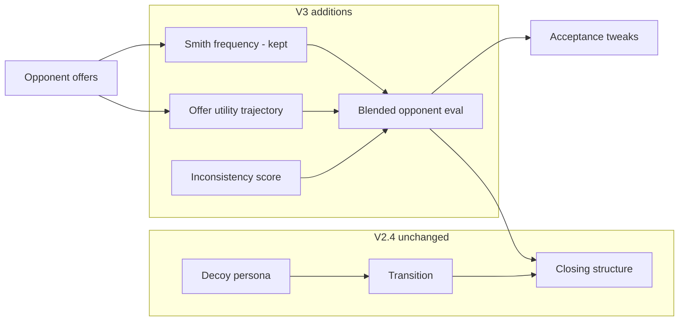

# Agent360 V3 — Plan (Opponent Modeling & Deception)

**Status:** Phase 2–3 complete — **V3 submission candidate** (`agent360_v3.py`)  
**Sparring pool:** 2024-lite opponents now use **decoy/bait by default** (`deceptive=True`) so V3’s trajectory logic is exercised.

### Latest sparring (2 repeats, deceptive opponents)

| Agent | Score | Advantage | Concealing |
|-------|-------|-----------|------------|
| V2.4 (`sparring_v24_deceptive.csv`) | 1.269 | 0.623 | 0.646 |
| **V3 (`sparring_v3.csv`)** | **1.185** | 0.604 | 0.581 |

V3 wins big on **deceptive** Shochan/UO/Renting second seat (+0.45–0.60 vs V2.4) and ISBT×UO first (+0.19).  
Mirror first remains noisy (diagnostic only — exclude from promotion).

**Submit `Agent360V3`** for competition; keep `Agent360V2` as fallback if Concealing dominates on leaderboard.

```bash
uv run python scripts/eval_sparring.py --agent v3 --repeats 2 -o results/sparring_v3.csv
uv run python scripts/eval_sparring.py --agent v2 --repeats 2 -o results/sparring_v24_deceptive.csv
uv run python scripts/_compare_sparring_csvs.py
```

Historical honest-opponent baseline: V2.4 **1.179** (`sparring_v24.csv`).

---

## 1. Motivation

V2.4 optimizes **Concealing** (how well we hide our preferences from the opponent). V2.x improvements are largely **exhausted**:

- Phase timing, decoy rotation, long decoy, soft transition (V2.5) — tested, no net gain.
- Remaining sparring losses are not fixed by bidding **more randomly** or **longer decoy**.

| Remaining weakness (V2.4) | Opponent behavior | Why V2 can’t fix it |
|---------------------------|-------------------|---------------------|
| ISBT × UOAgentLite **first** | Rational filter + RV tracking | We don’t exploit their bid inconsistencies |
| Laptop × LearnerStrong **first** | Strong Smith on our stream | Hiding helps; doesn’t improve **our** deal extraction |
| Low Advantage on some first-seat rows | Opponent bluffing / misleading bids | Smith assumes honest frequency signal |

**V3 goal:** Improve **Advantage** (and indirectly Score) by **seeing through opponent deception**—while **keeping V2.4’s concealment persona unchanged**.

---

## 2. Goals and non-goals

### Goals

| ID | Goal |
|----|------|
| G1 | Track opponent **offer-utility trajectory** over time (not just issue frequencies) |
| G2 | Detect **inconsistent** opponent bids vs their learned persona |
| G3 | Use enhanced model in **closing** and **acceptance** to avoid opponent traps |
| G4 | Beat V2.4 on sparring + learner panels without Concealing regression |

### Non-goals (V3 scope)

| ID | Non-goal |
|----|----------|
| N1 | Opponent-type routing at runtime (same constraint as V2) |
| N2 | Replacing decoy / transition / closing **persona** (inherit from V2.4) |
| N3 | Oracle access to opponent true `ufun` |
| N4 | Full port of 2024/2025 agents (use sparring ideas only) |

---

## 3. Architecture (proposed)



**Class layout:**

| File | Class | Inherits |
|------|-------|----------|
| `agent360_v3.py` | `Agent360V3` | `Agent360V2` |

V2.4 behavior remains default; V3 overrides **opponent model** and **how closing/acceptance use it**.

---

## 4. Component design

### 4.1 Offer-utility trajectory model

Inspired by RentingLite / curve-fit opponents—inverted for **us** modeling **them**.

**Data:** list of `(relative_time, u_hat(offer))` where `u_hat` comes from current Smith estimate at record time.

**Use:**

- Estimate opponent **concession rate** (slope of utility vs time).
- Predict whether their next acceptance threshold is **high or low**.
- Flag **non-monotone** jumps (possible bluff or decoy persona).

```python
# Sketch — agent360_v3.py
class OfferTrajectoryModel:
    def record(self, relative_time: float, estimated_u: float) -> None: ...
    def predicted_utility_at(self, t: float) -> float: ...
    def concession_slope(self) -> float: ...
    def is_non_monotone(self) -> bool: ...
```

### 4.2 Inconsistency / bluff detection

Compare each new opponent offer to what frequency + trajectory predict:

| Signal | Interpretation |
|--------|----------------|
| Offer very high on Smith est but low on trajectory fit | Possible **bait** (they want us to concede on wrong issues) |
| Sudden issue flip after stable frequency | Possible **decoy persona** (like our V2) |
| Monotone utility drop matching Boulware | **Honest** time-based conceder → trust Smith more |

Output: `bluff_score ∈ [0, 1]` per offer or per step.

### 4.3 Blended opponent evaluation

Replace single Smith `eval(offer)` in closing with:

```text
opp_eval(offer) = α · smith(offer) + (1−α) · trajectory_fit(offer) − β · bluff_penalty(offer)
```

Tune `α`, `β` on sparring panel. When `bluff_score` high, **reduce** opponent weight in closing (don’t chase their bait).

### 4.4 Acceptance adjustments (conservative)

Only when trajectory + inconsistency suggest opponent is **trapping** us:

- Require slightly higher utility vs aspiration before accept.
- Do **not** reject good deals near deadline (`t > 0.92` rule stays).

---

## 5. Implementation phases

### Phase 1 — Trajectory + logging (1–2 days) ✅

| Task | Deliverable |
|------|-------------|
| `OfferTrajectoryModel` | `agent360_v3.py` + `tests/test_agent360_v3.py` |
| Wire into `update_opponent_model` | Records `(relative_time, smith_u)` per opponent bid |
| Expose blended eval behind flag | `Agent360V3` — `SMITH_BLEND=1.0`, closing unchanged |

**Pass gate:** run parity check:

```bash
uv run pytest tests/test_agent360_v3.py -q
uv run python scripts/eval_sparring.py --agent v3 --repeats 2 -o results/sparring_v3.csv
uv run python scripts/_compare_sparring_csvs.py results/sparring_v24.csv results/sparring_v3.csv
```

Score should match V2.4 within ~0.01 (Phase 1 uses Smith-only closing).

### Phase 2 — Closing integration (2–3 days)

| Task | Deliverable |
|------|-------------|
| Override `_pick_closing_bid` | Use blended `opp_eval` |
| Grid search α, β on sparring | CSV via `eval_sparring.py --agent v3` |
| Target rows: ISBT×UOAgent first, Laptop×LearnerStrong first | Compare traces |

**Pass:** Sparring mean Score ≥ V2.4 (1.179) **or** Advantage +0.02 with Concealing ≥ 0.59.

### Phase 3 — Acceptance + inconsistency (2–3 days)

| Task | Deliverable |
|------|-------------|
| Bluff detection heuristic | Tests on scripted offer sequences |
| Light acceptance tightening | Only when bluff_score > threshold |
| Full panel + learners | `sparring_v3_full.csv` |

**Pass:** Full panel Score ≥ 1.215 (V2.4 full baseline) with no scenario regression &gt; 0.05 on Car/ISBT.

### Phase 4 — Optional upgrades

| Upgrade | Source idea |
|---------|-------------|
| Issue-weighted Smith (`GAgentXFrequencyModel` / HardHeaded) | NegMAS / Genius |
| Separate trajectory for **our** bids (self-monitor) | Diagnostic only |
| Multilateral seat interpolation | If competition extends |

---

## 6. Evaluation plan

Same harness as V2:

```bash
# After implementing Agent360V3
uv run python scripts/eval_sparring.py --agent v3 --repeats 2 --output results/sparring_v3.csv
uv run python scripts/eval_sparring.py --agent v3 --repeats 2 --include-learners --output results/sparring_v3_full.csv
uv run python scripts/_compare_sparring_csvs.py results/sparring_v24.csv results/sparring_v3.csv
```

### Success criteria (promote V3 over V2.4)

| Metric | V2.4 baseline | V3 target |
|--------|---------------|-----------|
| Sparring mean Score | 1.179 | **≥ 1.19** |
| Learner mean Score | 1.289 | **≥ 1.29** |
| Concealing (sparring) | 0.608 | **≥ 0.60** |
| ISBT × UOAgentLite first | ~0.85 | **≥ 1.0** |

If V3 improves Advantage but drops Concealing below 0.58, **keep V2.4 for submission** and iterate.

### Debug traces (Phase 2)

```bash
uv run anl2026 run --scenario ISBTAcquisition --no-plot --negotiator agent360_v3.Agent360V3 \
  --opponent sparring.uoagent_lite.UOAgentLite --negotiator-first \
  --export-trace results/isbt_uo_v3_first.csv

uv run anl2026 run --scenario Laptop --no-plot --negotiator agent360_v3.Agent360V3 \
  --opponent sparring.learner_strong.LearnerStrong --negotiator-first \
  --export-trace results/laptop_learner_v3_first.csv
```

---

## 7. Files to add / modify

| File | Action |
|------|--------|
| `agent360_v3.py` | **New** — `Agent360V3`, trajectory + blended eval |
| `tests/test_agent360_v3.py` | **New** — trajectory, parity, negotiation completes |
| `scripts/eval_sparring.py` | Add `--agent v3` |
| `docs/agent360-v2.4-strategy.md` | Frozen reference (no V3 mixed in) |
| `docs/sparring-and-fixes.md` | Link V3 plan; update F7 status when started |

**Do not modify** `Agent360V2` after V3 work begins (submission freeze).

---

## 8. Risks and mitigations

| Risk | Mitigation |
|------|------------|
| Overfitting sparring opponents | Hold out BOA/MAP/MiCRO learner panel; don’t tune on Mirror |
| Concealing regression | V3 changes **closing/acceptance only**; decoy persona unchanged |
| Complexity / bugs | Phase 1 parity gate; subclass V2, don’t fork |
| Bluff detector false positives | Conservative β; never block deadline accepts |

---

## 9. Relationship to V2.4 (report wording)

> **V2.4** implements a fixed **concealment strategy** (phased decoy persona + first-seat min-offer gate) and a **Smith frequency model** for opponent offers used mainly in closing. **V3** extends opponent modeling with temporal and consistency signals to improve deal quality against deceptive opponents, without changing the concealment bid stream that earned our sparring Concealing scores.

---

## 10. Open questions (decide in Phase 1)

1. **Single blended model** vs separate `opponent_ufun` wrapper for competition API?
2. Should trajectory use **our** Smith estimate of their utility or **issue-only** proxy before Smith converges?
3. Publish V3 as `Agent360V3` only, or merge into V2 after validation?

**Recommendation:** Separate class `Agent360V3` until promotion; keep `Agent360V2` as submission artifact.
