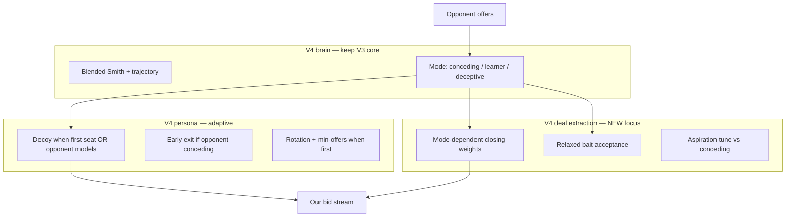

# Agent360 V4 — Plan (post-leaderboard recovery)

> **Authoritative V4 reference:** [agent360-v4-strategy.md](agent360-v4-strategy.md) (V4.2 active, report outline §27). This file is the historical development plan.

**Status:** V4 shipped — **~9th place** (first V4 upload); V4.3 in `submitted_v4.zip` queued for next tournament.  
**V3 baseline:** rank 28, score **4,099** (tournament #19035).

**Goal:** Ship **V4** as the new `agent360_submit.py` / `submitted.zip` with a **documented +0.5–1.0 mean Score** gain on the **competition proxy panel** (below), without learner Concealing below **0.60**.

---

## 1. What went wrong (honest post-mortem)

| Assumption (V3) | Reality (live tournament) |
|-----------------|----------------------------|
| Sparring deceptive panel ≈ 2026 field | Field is **30 strong student agents** (DecepTor, CunningMerchant, swingv2, …) |
| Beat V2.4 on sparring excl. Mirror → submit | We beat V2.4 locally but **lost ~47% of top total Score** |
| More opponent intelligence always helps | V3 **bait guards + conservative closing** likely **sacrificed Advantage** |
| Concealing-first middle path is enough | When **both** agents deceive, Concealing → **~0.4–0.6**; **Advantage decides** |
| Slow rank climb = OK | **28/30 is not OK** — only above DefaultAgent / GroupN |

**Root cause in one line:** We optimized **Concealing vs our sparring lites**; the leaderboard sums **Advantage + Concealing** across all opponents, and top agents **win on deal quality** in agent-vs-agent closing.

**Local evidence (submission agent, May 2026):**

| Panel | Mean Advantage | Mean Concealing | Mean Score |
|-------|----------------|-----------------|------------|
| Learners (BOA/MAP/MiCRO) | 0.58 | 0.72 | 1.30 |
| Full quick panel | 0.53 | 0.78 | 1.32 |
| Time-based only | higher | **1.00** | ~1.43 |

- **First seat vs learners:** Concealing often **0.48–0.55** (leak).
- **vs conceders:** Concealing always 1.0 — **long decoy only hurts Advantage**.
- **Worst:** `Car × SimpleNegotiator` first — Concealing **0.0**.

---

## 2. V4 thesis

> **Keep concealment when it pays; stop paying for it when it doesn't. Win closing.**

V4 is **not** Reverse and **not** a new decoy family. It is **V3 opponent model + adaptive persona + Advantage-first closing/acceptance**.



**Design constraints (unchanged):**

- No opponent-class routing (no `if BOANeg`).
- No oracle opponent utility.
- Observable signals + seat only.

---

## 3. V4 components (what to build)

### 3.1 Adaptive decoy exit (P0 — highest ROI)

**Problem:** Staying in decoy until t≥0.35 **and** min-offers when opponent is a **Boulware/Conceder** wastes rounds; Concealing is already 1.0 vs them.

**Change:** Override `transition_allowed()` / `_in_decoy_phase()` in V4:

```text
If opponent_mode() == "conceding" AND trajectory.concession_slope() <= CONCEDING_SLOPE_THRESHOLD:
    allow transition even if first-seat min-offers not met (after 1 opponent offer minimum)
```

| Constant | Proposed |
|----------|----------|
| `CONCEDING_EARLY_EXIT_MIN_OPP_OFFERS` | 1 |
| Keep min-offers gate | vs learner / unknown / deceptive only |

**Hypothesis:** +0.05–0.15 Advantage vs time-based panel, **zero** Concealing cost.

---

### 3.2 Relaxed bait guards (P0)

**Problem:** V3 rejects / discounts offers when `deceptive` + trajectory mismatch — real opponents may trigger false positives → **missed agreements**.

**Changes:**

| Knob | V3 | V4 proposal |
|------|-----|-------------|
| `ACCEPT_BAIT_THRESHOLD` | 0.08 | **0.14** (or disable acceptance bait entirely) |
| `BAIT_THRESHOLD` (closing) | 0.10 | **0.14** |
| `BAIT_DISCOUNT` | 0.45 | **0.30** |
| `_should_apply_bait_discount` | deceptive + concealment signals | require **≥ 5** trajectory samples **and** `_opponent_late_bait_switch()` |

**Hypothesis:** +Advantage vs deceptive agents; small Concealing risk.

---

### 3.3 Mode-dependent closing (P0)

**Problem:** Single closing cap (0.45) is too timid vs conceding, too aggressive vs bait.

**Change:** Override `effective_closing_opponent_weight_cap()` and/or base `CLOSING_OPPONENT_WEIGHT_CAP`:

| Mode | Opponent weight cap | Min our utility (closing) |
|------|---------------------|-------------------------|
| **conceding** | **0.52** | default |
| **learner** | **0.42** | default |
| **deceptive** | **0.32** | **+0.03** floor (more selfish) |
| **unknown** (early) | 0.40 | default |

Reuse V2.6a idea (`Agent360V2ClosingA` cap 0.38) **only** for deceptive mode, not globally.

---

### 3.4 First-seat Concealing hardening (P1)

**Problem:** First seat vs BOA/MAP → Concealing ~0.5; tournament sum bleeds.

**Changes (test as ablations, merge best):**

| Ablation | Change |
|----------|--------|
| `v4.min4` | `FIRST_MIN_OPPONENT_OFFERS = 4` |
| `v4.jumpdecoy` | First-seat decoy picks **max utility gap** from last bid (V2.5 `_pick_decoy_bid`) |
| `v4.long38` | First-seat `decoy_phase_end` → **0.38** when min-offers gate active |

**Do not** merge full FirstSeat combo (long 0.42 + min + rotate) — regressed sparring before.

**Target:** first-seat learner Concealing **≥ 0.62** (currently ~0.50–0.55).

---

### 3.5 Aspiration tune (P1)

**Problem:** `aspiration = max_u × (1 − 0.55×t)` may accept too early vs strong closers.

**Change (V4 only when mode == conceding):** slope **0.50** instead of 0.55 (slightly pickier).

**Change (V4 when mode == deceptive and t < 0.85):** slope **0.58** (pickier — don’t accept bait).

---

### 3.6 What we keep from V3 (do not rip out)

- `OfferTrajectoryModel`, `TimedOpponentModel`, `RecencyBlendedSmith`
- Issue-weighted late Smith
- `_opponent_mode()` profiling (with relaxed deceptive triggers)
- Published `_blended_opponent_utility` for `opponent_ufun`
- V2.4 maximal-mismatch decoy pool
- First-seat decoy rotation (keep)

---

### 3.7 What we explicitly do NOT do in V4

| Idea | Why not |
|------|---------|
| Full **Reverse** submit | Concealing collapse vs learners |
| Full **flip** | Unreliable |
| Opponent-type routing | Overfit / fragile |
| Tune on **Mirror** mean | Diagnostic only |
| More complex bait logic | V3 already too paranoid |
| NiceOrDie-specific hacks | Unless ANAC Min shows it dominates losses |

**Optional V4.1 (only if P0–P1 insufficient):** truth-first for **first 2 bids** when first seat only — high risk, learner Concealing test required.

---

## 4. Implementation layout

| File | Class | Role |
|------|-------|------|
| `agent360_v4.py` | `Agent360V4` | Inherits `Agent360` (V3), overrides listed hooks |
| `agent360_submit.py` | `Agent360` | **Promote V4 → here** when gates pass |
| `tests/test_agent360_v4.py` | — | conceding early exit, bait relaxed, completes negotiation |

**Override points (minimal diff):**

```python
class Agent360V4(Agent360):
    def transition_allowed(self) -> bool: ...
    def acceptance_strategy(self, state) -> bool: ...
    def effective_closing_opponent_weight_cap(self) -> float: ...
    def estimated_opponent_utility(self, offer) -> float: ...  # bait discount
    def _should_apply_bait_discount(self) -> bool: ...
    # optional: aspiration helper, _pick_decoy_bid for jumpdecoy ablation
```

**Eval registration:** add `"v4"` to `eval_learners.py`, `eval_sparring.py`, `eval_h2h.py`.

---

## 5. Evaluation — competition proxy panel

**Stop using** sparring-only mean as the promotion metric.

### 5.1 Primary panel (promotion)

Run all 7 scenarios × both seats × **4 repeats**:

| Bucket | Opponents | Weight in decision |
|--------|-----------|-------------------|
| **Learners** | BOANeg, MAPNeg, MiCRO | **40%** — guardrail Concealing |
| **Deceptive sparring** | ShochanLite, UOAgentLite, RentingLite (`deceptive=True`) | **40%** |
| **Time-based** | Boulware, Conceder, Linear | **20%** — Advantage only |

```bash
uv run python scripts/eval_learners.py --agent v4 --repeats 4 -o results/v4_learners.csv
uv run python scripts/eval_sparring.py --agent v4 --panel deceptive --repeats 4 -o results/v4_sparring.csv
uv run python scripts/evaluate_noamneg.py --quick --negotiator agent360_v4.Agent360V4 --repeats 4 -o results/v4_conceders.csv
```

### 5.2 Guardrails (must pass)

| Metric | V3 submit baseline | V4 minimum |
|--------|-------------------|------------|
| Learner mean **Concealing** | ~0.72 | **≥ 0.60** |
| Learner mean **Score** | ~1.30 | **≥ 1.28** (no regression) |
| Deceptive sparring **Score** | ~1.26 | **≥ 1.24** |
| H2H vs Reverse **Score** | loses | **not required to win** |

### 5.3 Promotion rule

Promote V4 to `agent360_submit.py` if:

```text
competition_proxy_score(V4) >= competition_proxy_score(V3) + 0.08
AND learner_concealing(V4) >= 0.60
```

`competition_proxy_score` = weighted mean from §5.1.

### 5.4 Secondary (sanity)

```bash
uv run python scripts/eval_h2h.py --agent-a v4 --agent-b submission --repeats 3
uv run python scripts/eval_stress.py --agent v4 --agent submission --repeats 2
```

---

## 6. Phased schedule (aggressive)

| Day | Deliverable | Exit criterion |
|-----|-------------|----------------|
| **D1** | `Agent360V4` with §3.1 + §3.2 + §3.3 (P0) | Learner Score ≥ 1.28, conceder Advantage up |
| **D2** | First-seat ablations §3.4 (min4, jumpdecoy) | First-seat learner Concealing ≥ 0.60 |
| **D3** | Aspiration §3.5 + grid on closing caps | Proxy score ≥ V3 + 0.08 |
| **D4** | Promote → `agent360_submit.py`, tests, zip | `make_submitted_zip.bat`, upload |
| **D5** | ANAC tournament result | Read Stats → plan V4.1 if needed |

**June 11** — last qualification tournament. **June 15** — final submission.

---

## 7. ANAC diagnostics (you do once, before D1)

On [ANAC home](https://anac.cs.brown.edu/home) → **Stats** for Agent360:

| Field | Drives V4 priority |
|-------|-------------------|
| Mean **Advantage** | If ≪ top → prioritize §3.1, §3.3, §3.5 |
| Mean **Concealing** | If ≪ top → prioritize §3.4 |
| **Min** | If near 0 → check timeouts / NiceOrDie |
| **Exceptions** | If > 0 → fix before strategy |

Paste these three numbers when starting implementation — we pick P0 vs P1 order.

---

## 8. Success targets (realistic)

| Target | Score (tournament sum) | Rank |
|--------|------------------------|------|
| Current | 4,099 | 28 |
| **V4 minimum viable** | **~5,500–6,000** | ~22–25 |
| **V4 stretch** | **~6,500+** | ~18–22 |
| Top 10 | 7,300+ | requires V4.1 or more Advantage |

We will **not** reach top 3 with persona tweaks alone — but we can **leave the bottom tier** with P0+P1.

---

## 9. Submission checklist (when V4 promotes)

```text
1. agent360_v4.py passes tests
2. competition proxy >= V3 + 0.08, learner Concealing >= 0.60
3. Copy V4 logic → agent360_submit.py (class Agent360)
4. make_submitted_zip.bat
5. Upload: Module agent360, Class Agent360
6. Verify next tournament on leaderboard
```

---

## 10. One sentence

**V4 = same decoy identity, but stop decoying against conceders, stop rejecting good deals from bait paranoia, and close harder — measured on learners + deceptive sparring + conceders, not Mirror.**
