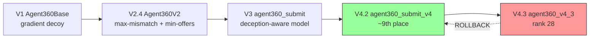
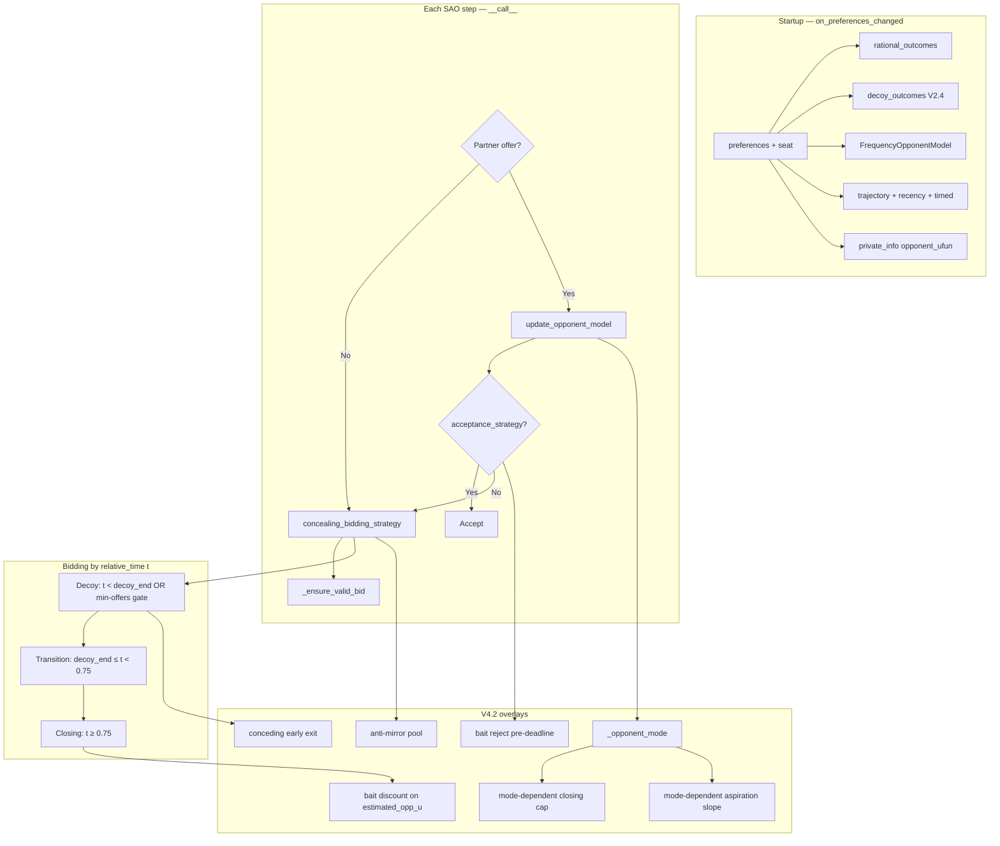
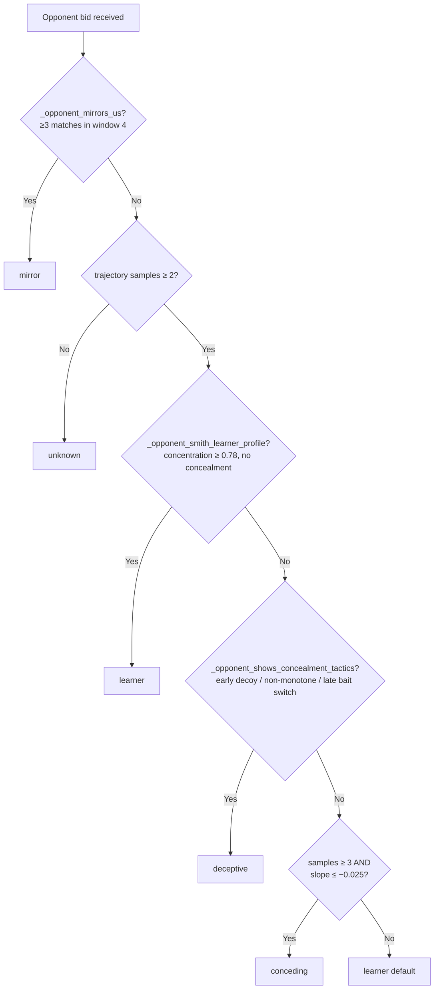
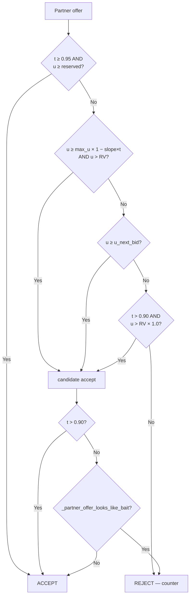

# Agent360 V4 — Strategy Reference & Report Source (ANL 2026)

**Active submission:** V4.2 — **10th / 31** (latest tournament); first V4 upload **~9th / 31**  
**Module / class:** `agent360` / `Agent360`  
**Zip:** `submitted_v4.zip` (built from `agent360_submit_v4.py`)  
**Dependencies:** `negmas>=0.15.4` (`requirements.txt`)  
**Protocol:** Bilateral SAO (Stackelberg alternating offers) via NegMAS `SAOCallNegotiator`

**V3 legacy:** rank **28**, total score **~4,099**, tournament **#19035** (`submitted.zip` / `agent360_submit.py`)  
**V4.3 failed:** rank **28** again → **reverted**; archived in `agent360_v4_3.py`  
**Current state:** V4.2 rollback **confirmed** — rank **10 / 31** on latest official tournament

This document is the **authoritative V4 reference** for development, debugging, and the course report (`report/report.tex`). It extends [agent360-submission-strategy.md](agent360-submission-strategy.md) (V3) with tournament outcomes, V4.2/V4.3 deltas, and §27 report outline.

**Related docs:** [agent360-v4-plan.md](agent360-v4-plan.md) (historical development plan), [agent360-v2.4-strategy.md](agent360-v2.4-strategy.md), [evaluation.md](evaluation.md)

---

## Table of contents

1. [Executive summary](#1-executive-summary)
2. [Tournament results & V4.3 post-mortem](#2-tournament-results--v43-post-mortem)
3. [Competition scoring](#3-competition-scoring)
4. [Design philosophy](#4-design-philosophy)
5. [Evolution V1 → V4.3](#5-evolution-v1--v43)
6. [Class and file layout](#6-class-and-file-layout)
7. [Architecture](#7-architecture)
8. [Three-phase persona](#8-three-phase-persona)
9. [Seat-based V4.2 profiles](#9-seat-based-v42-profiles)
10. [V2.4 decoy pool](#10-v24-decoy-pool)
11. [Opponent modeling stack](#11-opponent-modeling-stack)
12. [Opponent mode classification](#12-opponent-mode-classification)
13. [Published `opponent_ufun` blend pipeline](#13-published-opponent_ufun-blend-pipeline)
14. [Closing-phase bid selection](#14-closing-phase-bid-selection)
15. [Bait detection](#15-bait-detection)
16. [Anti-mirror](#16-anti-mirror)
17. [V4.2 acceptance strategy](#17-v42-acceptance-strategy)
18. [Main loop](#18-main-loop)
19. [V4.2 constants reference](#19-v42-constants-reference)
20. [V4.3 archived constants & rollback](#20-v43-archived-constants--rollback)
21. [Version changelog & rollback decision](#21-version-changelog--rollback-decision)
22. [No oracle](#22-no-oracle)
23. [Evaluation scripts & local proxy results](#23-evaluation-scripts--local-proxy-results)
24. [Submission packaging](#24-submission-packaging)
25. [Known weaknesses (for report)](#25-known-weaknesses-for-report)
26. [Debugging](#26-debugging)
27. [Report outline](#27-report-outline)

---

## 1. Executive summary

**Agent360 V4.2** is a **concealment-first bilateral negotiator** upgraded for **Advantage extraction** against the real ANL 2026 field. It maximizes:

$$\text{Score} = \text{Advantage} + \text{Concealing}$$

| Goal | Mechanism |
|------|-----------|
| **Concealing** | V2.4 decoy persona: maximal-mismatch pool, first-seat min-offer gate (4 bids), decoy rotation + utility jumps, extended first-seat decoy window (t < 0.40) |
| **Advantage** | V3 deception-aware opponent model + **V4 deal extraction**: conceding early exit, relaxed bait guards, mode-dependent closing caps, mode-tuned aspiration slopes |

### Tournament arc: V3 → V4.2 → V4.3 → rollback

```text
V3 submit (tournament #19035)
  rank 28 / 30, score ~4,099
  diagnosis: sparring panel ≠ real field; bait paranoia + timid closing → lost Advantage
       ↓
V4.2 (first V4 upload → submitted_v4.zip)
  ~9th place — major recovery
  thesis: keep concealment when it pays; stop paying when it doesn't; close harder
       ↓
V4.3 (queued in submitted_v4.zip)
  rank 28 again — full regression to V3 tier
  local proxy slightly favored V4.3 (+0.006 mean) — tournament disagreed
       ↓
ROLLBACK to V4.2 in submitted_v4.zip
  V4.3 frozen in agent360_v4_3.py for post-mortem only
  latest tournament: 10th / 31 — rollback confirmed
```

**Active agent = V4.2 logic** inlined in `agent360_submit_v4.py` as class `Agent360`. V4.3 changes are **not** in the active submission.

**One sentence:** V4.2 is V2.4 decoy concealment + V3 opponent intelligence + tournament-tuned Advantage closing — proven ~9th on the live leaderboard; V4.3 over-tuned learner closing and acceptance escape and was reverted after rank-28 regression.

---

## 2. Tournament results & V4.3 post-mortem

### 2.1 Tournament results table

| Version | Zip / source | Tournament | Rank (of ~30) | Total score | Notes |
|---------|--------------|------------|---------------|-------------|-------|
| **V3** | `submitted.zip` / `agent360_submit.py` | #19035 | **28** | **~4,099** | Bottom tier; above DefaultAgent / GroupN only |
| **V4.2** | `submitted_v4.zip` / `agent360_submit_v4.py` | first V4 upload | **~9 / 31** | TBD | Major recovery; validated V4 thesis |
| **V4.3** | `submitted_v4.zip` (V4.3 build) | follow-up | **28 / 31** | TBD | Same tier as V3 — immediate rollback |
| **V4.2 (restored)** | `submitted_v4.zip` (reverted) | latest | **10 / 31** | TBD | Rollback confirmed; stable top tier |

**Interpretation:** V4.2's P0 changes (conceding early exit, relaxed bait, mode-dependent closing) matched the **real student-agent field**. V4.3's incremental tuning **looked better locally** but **hurt tournament sum** — likely by accepting too early, exiting decoy too late/early on wrong seats, and chasing learner agreements at Concealing cost.

### 2.2 V4.3 post-mortem table

| Change (V4.3 vs V4.2) | Constant / behavior | Intended benefit | Observed / hypothesized harm |
|------------------------|---------------------|------------------|------------------------------|
| Stricter first-seat gate | `FIRST_MIN_OPPONENT_OFFERS` 4 → **5** | More Concealing vs curve-fit openers | Wasted rounds vs conceders; delayed true closing |
| Shorter second-seat decoy | `SECOND_DECOY_PHASE_END` **0.32** (vs 0.35) | Faster transition when opponent opens | Earlier preference leak vs learners when second |
| Conceding early exit **second seat only** | `transition_allowed()` override | Protect first-seat Concealing | First seat stuck in decoy vs Boulware/Conceder → Advantage loss |
| **Accept escape tier** | `ACCEPT_ESCAPE_TIME` **0.88** | Accept RV-level deals late-mid game | **V4.2 has NO escape tier** (disabled at 2.0) — V4.3 accepted too many mediocre deals |
| Earlier bait-guard cutoff | `BAIT_REJECT_MAX_TIME` **0.78** | More agreements vs deceptive | Accepted bait offers tournament opponents exploited |
| Higher learner closing cap | `CLOSING_CAP_LEARNER` 0.48 → **0.50** | Chase learner agreements | Over-fit Smith → worse Concealing vs BOA/MAP |
| Higher unknown closing cap | `CLOSING_CAP_UNKNOWN` 0.40 → **0.44** | Better closing vs unknown | Chased wrong issue dimensions |
| More selfish learner boost | `CLOSING_LEARNER_UTILITY_BOOST` 0.04 → **0.06** | Advantage vs learners | Reduced opponent-weighted bait-and-switch |
| Larger learner sample | `CLOSING_LEARNER_SAMPLE_CAP` 40 → **55** | Better closing candidate search | Noise in high-cap sample |
| Pickier conceding aspiration | `ASPIRATION_SLOPE_CONCEDING` 0.42 → **0.40** | Hold out vs conceders | Missed agreements / timeouts |
| Looser learner aspiration | `ASPIRATION_SLOPE_LEARNER` 0.52 → **0.48** | Accept earlier vs learners | Low Advantage agreements |
| Stronger first-seat stable blend | `FIRST_STABLE_ISSUE_BLEND` 0.14 → **0.20** | Track learner issue prefs | Over-trusted early opponent signal |

**Rollback rule:** Tournament rank is the promotion metric. Local proxy within +0.01 is **insufficient** to override a rank-28 regression.

---

## 3. Competition scoring

Implemented in `main.calc_scores` (organizer rules):

| Metric | Definition |
|--------|------------|
| **Advantage** | `utility(agreement) − reserved_value` for our agent |
| **Concealing** | Share of one normalized point from **Kendall agreement** between opponent's published `opponent_ufun` and our true `ufun` (zero-sum between negotiators) |
| **Score** | Advantage + Concealing |

**Design implications:**

1. **Bid stream** is the primary Concealing lever — mislead *their* learner, not only improve *our* model.
2. **Published `opponent_ufun`** affects our Advantage (closing + acceptance) and indirectly Concealing share.
3. When **both** agents deceive, Concealing → ~0.4–0.6; **Advantage decides** rank (V4 lesson from V3 tournament).
4. vs pure time-based conceders, Concealing is often **1.0** — long decoy **only hurts Advantage**.

---

## 4. Design philosophy

### 4.1 Concealment-first, Advantage-aware

V4 does **not** abandon the decoy persona (unlike Reverse/Full). It **conditionally** shortens decoy and **aggressively** closes when Concealing is already won (conceders) or opponent is a plain learner (no bait discount).

### 4.2 No oracle

Only information from **observed offers** and **mechanism seat** — never opponent true `ufun`. See [§22](#22-no-oracle).

### 4.3 Seat matters

First proposer (seat 0) leaks more signal; V4.2 applies **strict min-offer gate**, **longer decoy window** (0.40), **slower transition** (scale 0.72), **decoy rotation**, **utility-jump picks**, and **higher late-blend cap** (0.68). Second seat uses recency blend and standard 0.35 decoy end.

### 4.4 Tournament-driven iteration

| Stage | Promotion criterion |
|-------|---------------------|
| V3 → V4 | Local competition proxy + learner Concealing guardrail |
| V4.2 → V4.3 | Local proxy +0.006 (failed) |
| V4.3 → rollback | **Tournament rank 28** — absolute veto |

**Proxy panel** (280 cells): 7 scenarios × 2 seats × (3 learners + 12 stress + 5 sparring) — see [§23](#23-evaluation-scripts--local-proxy-results).

### 4.5 Separate concerns (unchanged from V3)

| Layer | Question | V4 change |
|-------|----------|-----------|
| **Persona** | What do we *show*? | Adaptive exit vs conceders; first-seat hardening |
| **Opponent model** | What do they *want*? | Same V3 stack; V4.3 stable-blend tweak reverted |
| **Acceptance** | Trap or deal? | Catastrophe + aspiration + AC-next + deadline; bait reject; **no escape tier in V4.2** |

### 4.6 No opponent-class routing

Never `if BOANeg:` at runtime. Adaptation uses **observable signals** + **seat** only.

---

## 5. Evolution V1 → V4.3

| Version | Class (dev) | Submission | Main idea |
|---------|-------------|------------|-----------|
| **V1** | `Agent360Base` | — | Phased decoy → transition → closing; moderate decoy pool (≥ n/3 mismatch) |
| **V2.3** | `Agent360V2` | — | Maximal-mismatch decoy pool (≥ half issues wrong) |
| **V2.4** | `Agent360V2` | — | First-seat min-offer gate (3 offers) |
| **V3** | `Agent360` in `agent360_submit.py` | `submitted.zip` | V2.4 persona + trajectory/recency/timed Smith + bait guards |
| **V4 / V4.2** | `Agent360` in `agent360_submit_v4.py` | `submitted_v4.zip` | V3 brain + **Advantage-first closing/acceptance** + conceding early exit |
| **V4.3** | `Agent360V43` in `agent360_v4_3.py` | *(reverted)* | Incremental learner/acceptance tuning — **failed tournament** |



**Rejected branches (not in submission):** `Agent360Reverse` (truth-first), `Agent360Full` (abrupt flip), V2.5 soft transition, opponent-type routing — see [agent360-submission-strategy.md §18](agent360-submission-strategy.md).

---

## 6. Class and file layout

### 6.1 Inheritance chain (in `agent360_submit_v4.py`)

```text
FrequencyOpponentModel
Agent360Base          ← V1 phased engine
Agent360V2            ← V2.4 decoy persona
[ V3/V4 helper classes: RecencyBlendedSmith, TimedOpponentModel, OfferTrajectoryModel, ... ]
Agent360              ← submission class (V4.2)
```

### 6.2 Repo files

| File | Class | Role |
|------|-------|------|
| **`agent360_submit_v4.py`** | `Agent360` | **Active submission source** — self-contained, copied to zip as `agent360.py` |
| **`agent360_v4_2.py`** | `Agent360V42` | Frozen V4.2 overrides for A/B eval (constants + `transition_allowed` / `decoy_phase_end`) |
| **`agent360_v4_3.py`** | `Agent360V43` | Archived V4.3 — **do not submit** |
| `agent360_v4.py` | `Agent360V4` | Dev alias → `agent360_submit_v4.Agent360` |
| `agent360_submit.py` | `Agent360` | V3 legacy → `submitted.zip` |
| `agent360.py` / `agent360_v2.py` / `agent360_v3.py` | variants | Dev / ablation only |

### 6.3 Zip mapping

| Upload artifact | Source |
|-----------------|--------|
| `submitted_v4.zip` → `agent360.py` | `agent360_submit_v4.py` |
| `submitted.zip` → `agent360.py` | `agent360_submit.py` (V3 legacy) |

---

## 7. Architecture



| Method | Role |
|--------|------|
| `on_preferences_changed` | Outcome pools, models, seat, publish `opponent_ufun` |
| `__call__` | Main loop; `_ensure_valid_bid` prevents null counters |
| `concealing_bidding_strategy` | Phase bids + anti-mirror post-process |
| `acceptance_strategy` | Catastrophe → aspiration → AC-next → deadline → bait reject |
| `update_opponent_model` | Smith + trajectory + recency + timed + mirror window |
| `estimated_opponent_utility` | Blended estimate with optional bait discount |
| `_published_opponent_utility` | Published model (blend without bait discount path uses same base) |

---

## 8. Three-phase persona

Phases use **relative time** `t ∈ [0, 1]`.

| Phase | Time window | Behavior |
|-------|-------------|----------|
| **Decoy** | `t < decoy_phase_end()` **OR** min-offer gate active | Bid from `decoy_outcomes` (rotated / utility-jump when first seat) |
| **Transition** | `decoy_end ≤ t < 0.75` | Mix decoy + true aspiration band; floor drops with progress |
| **Closing** | `t ≥ 0.75` | Maximize blended score: our utility + estimated opponent utility |

**Randomness:** `random.Random(hash((self.id, state.step)) & 0xFFFFFFFF)` — reproducible per step.

### 8.1 Decoy phase extension

`_in_decoy_phase(t)` is true when:

- `t < decoy_phase_end()` and decoy pool non-empty, **or**
- `not transition_allowed()` (min-offer gate / conceding early exit pending)

### 8.2 Transition details

- Utility band floor: `max_u × (0.92 − 0.35 × transition_progress)`.
- Decoy mix injected until `transition_progress < effective_transition_decoy_mix_until()` (0.6 default; **0.85 first seat**).
- `transition_progress` scaled by `transition_progress_scale()` (**0.72 first seat**).

### 8.3 Phase boundaries (V4.2)

| Seat | `decoy_phase_end` | `transition_phase_end` | Min opponent offers |
|------|-------------------|------------------------|---------------------|
| First (0) | **0.40** | 0.75 | **4** |
| Second (1) | 0.35 | 0.75 | 0 (gate off) |

---

## 9. Seat-based V4.2 profiles

| Parameter | First seat (0) | Second seat (1) |
|-----------|----------------|-----------------|
| `decoy_phase_end` | **0.40** (`FIRST_DECOY_PHASE_END`) | 0.35 (`DECOY_PHASE_END`) |
| `FIRST_MIN_OPPONENT_OFFERS` | **4** (gate active) | gate disabled |
| `transition_decoy_mix_until` | **0.85** | 0.60 |
| `transition_progress_scale` | **0.72** (slower reveal) | 1.0 |
| Decoy pick | Rotation (no repeat last **5**) + **max utility gap** vs last bid | Random from pool + anti-mirror |
| `FIRST_LATE_BLEND_MAX` | **0.68** in opponent blend | — |
| Recency blend | Not applied (first seat path) | Up to **0.55** weight |
| Stable issue blend | — | **0.14** when learner/conceding/unknown |
| Conceding early exit | **Yes** (any seat in V4.2) | **Yes** |

---

## 10. V2.4 decoy pool

Algorithm in `Agent360V2._build_decoy_pool`:

1. From top ~10% rational outcomes (min 3, max 30), infer **true preferred value per issue** (mode per issue).
2. Scan rational outcomes above floor: `max(RV, 55% × utility of weakest top-tier outcome)`.
3. Score by **count of mismatched issues** vs true preferences.
4. Keep outcomes with mismatch ≥ `⌈n_issues / 2⌉`.
5. Keep **maximum** mismatch tier; if < 3 outcomes, include near-max (−1 mismatch).

**Intent:** Rational outcomes that lie about **which issues matter** — stronger than V1's ≥ n/3 mismatch.

### 10.1 First-seat min-offer gate (V4.2: 4 offers)

```text
transition_allowed() =
  True   if conceding early exit (mode=conceding, slope ≤ threshold, ≥1 opp offer)
  True   if second seat OR FIRST_MIN_OPPONENT_OFFERS <= 0
  True   if _opponent_offer_count >= 4
  False  otherwise
```

**Motivation:** RentingLite-style agents fit `(t, u)` from our solo opening stream; gate forces their bids into the model.

### 10.2 First-seat decoy rotation + utility jump

When opening:

- Exclude outcomes in last **5** own decoy bids (`FIRST_DECOY_NO_REPEAT_WINDOW`).
- Among remaining pool, pick outcome with **largest** `|u(outcome) − u(last_bid)|` (utility jump).
- Apply `_anti_mirror_pool` before selection.

---

## 11. Opponent modeling stack

### 11.1 Smith baseline (`FrequencyOpponentModel`)

Per-issue value counts; score = `count(value) / max_count_on_issue`; mean across issues.

### 11.2 Recency-blended Smith (`RecencyBlendedSmith`)

Window = **5** recent opponent offers.

```text
weight = min(0.68, 0.22 + 0.09 × n_recent)
blended = (1 − weight) × full_smith + weight × recent_smith
```

Applied on **second seat** when `recent_count ≥ 2`.

### 11.3 Timed opponent model (`TimedOpponentModel`)

- Records `(t, offer)` for every opponent bid.
- Bids with `t ≥ 0.40` counted **3×** when building effective counts.
- `late_phase_estimated` — Smith on late bids only (≥ 2 late offers).
- `late_issue_weighted_estimated` — issue-weighted Smith on late bids.

### 11.4 Issue-weighted Smith (`issue_weighted_smith_estimate`)

Issues with high repetition (low spread) → **low weight** (decoy noise). Issues with spread → **high weight** (real negotiation). Matches UOAgent-style rational filters.

### 11.5 Offer trajectory model (`OfferTrajectoryModel`)

Records `(t, smith_u)` at each opponent bid.

| Method | Purpose |
|--------|---------|
| `concession_slope()` | Linear slope of Smith utility vs time |
| `predicted_utility_at(t)` | Extrapolate expected Smith utility |
| `is_non_monotone()` | ≥ 2 utility rises → deception signal |
| `inconsistency_vs_trajectory(u, t)` | Bluff magnitude |

**Honest concession:** slope ≤ **−0.04** (`HONEST_CONCESSION_SLOPE`).

### 11.6 Conceding early exit (V4.2 P0)

If `mode == conceding` and `concession_slope() ≤ −0.025` with ≥ **3** trajectory samples → `transition_allowed()` true after **1** opponent offer, bypassing min-offer gate.

**Rationale:** vs Boulware/Conceder, Concealing is already 1.0 — decoy only wastes Advantage.

---

## 12. Opponent mode classification

`_opponent_mode()` → `unknown | mirror | learner | deceptive | conceding`



### 12.1 Concealment tactic signals

**Early decoy persona** (`t < 0.40` offers):

- All early offers identical, **or**
- Issue flip rate ≥ **0.25**, **or**
- Smith utility spread ≥ **0.12**.

**Late bait switch** (`t ≥ 0.40`): preferred value flips on ≥ half of issues between first/second half of late offers.

**Non-monotone trajectory:** ≥ 2 significant utility rises.

Plain BOA/MAP → usually **learner**, not deceptive — avoids false bait triggers.

### 12.2 Mode → behavior summary

| Mode | Closing cap | Aspiration slope | Bait discount | Notes |
|------|-------------|------------------|---------------|-------|
| **conceding** | 0.52 | 0.42 | No | Early decoy exit allowed |
| **learner** | 0.48 | 0.52 | No | +0.04 utility boost after t>0.55 |
| **deceptive** | 0.32 | 0.58 (until t=0.85) | Yes | Higher min closing utility (0.75) |
| **mirror** | 0.38 | default | No | Plain Smith only |
| **unknown** | 0.40 | 0.55 | No | Conservative learner path |

---

## 13. Published `opponent_ufun` blend pipeline

Competition scores **Concealing** from opponent's fit to our true `ufun`; we publish `private_info["opponent_ufun"]` for their Advantage.

**Pipeline** (`_blended_opponent_utility` → `_published_opponent_utility`):

```text
1. full_smith = FrequencyOpponentModel estimate
2. IF timed.late_count ≥ 2:
     blend toward late_phase_estimated
     weight = min(cap, 0.22 + 0.08 × late_count)
     cap = FIRST_LATE_BLEND_MAX (0.68) if first seat else LATE_BLEND_MAX (0.55)
3. IF len(late_offers) ≥ 3:
     blend toward late_issue_weighted_estimated
     weight = min(0.32, 0.10 + 0.04 × n_late)
4. IF second seat AND recency.recent_count ≥ 2:
     blend toward recency_smith (up to 0.55)
5. IF second seat AND mode ∈ {learner, conceding, unknown} AND recency ≥ 3:
     blend STABLE_ISSUE_BLEND (0.14) toward stable issue match score
6. IF mirror: return plain full_smith (skip blends)
7. Clamp to [0, 1]
```

**Closing** uses `estimated_opponent_utility` which may apply **bait discount** on top of this blend when deceptive.

---

## 14. Closing-phase bid selection

`_pick_closing_bid` (V4.2):

1. **Min our utility** ramps from mode-dependent start to **0.52** of max through closing:
   - Default start **0.72**; learner **0.70**; deceptive **0.75**.
2. Filter `rational_outcomes` above floor.
3. **Opponent weight** `w = min(cap, 0.15 + 0.35 × (t − 0.75))` with mode cap from [§12.2](#122-mode--behavior-summary).
4. Sample up to **40** candidates (**55** was V4.3 only); learner uses cap **40**.
5. **Learner boost:** `my_weight = min(0.92, (1−w) + 0.04)` when learner and `t > 0.55`.
6. Maximize: `my_weight × (my_u/max_u) + (1−my_weight) × estimated_opponent_utility(offer)`.
7. Random tie-break among best outcomes.

---

## 15. Bait detection

### 15.1 When bait logic applies (`_should_apply_bait_discount`)

All required:

- Not mirror
- Closing phase active (≥ 3 trajectory samples)
- Mode == **deceptive**
- `_opponent_late_bait_switch()` true
- Not plain Smith learner
- ≥ **5** trajectory samples (`BAIT_MIN_TRAJECTORY_SAMPLES`)

### 15.2 Offer looks like bait

- Trajectory slope not faster than honest (**≥ −0.04**)
- `smith_u > predicted(t) + 0.14` (`BAIT_THRESHOLD`)

### 15.3 Discount (closing evaluation)

```text
excess = smith_u − predicted − BAIT_THRESHOLD
adjusted = predicted + BAIT_THRESHOLD + excess × (1 − BAIT_DISCOUNT)   # BAIT_DISCOUNT = 0.30
IF inconsistency > 0.18: blend 38% toward predicted
```

### 15.4 Acceptance bait guard (`_partner_offer_looks_like_bait`)

Reject accepted offer (pre-deadline) when deceptive + concealment signals + slope not honestly conceding + `smith_u > predicted + 0.14` (`ACCEPT_BAIT_THRESHOLD`).

**V4.2:** bait reject active until `ACCEPT_DEADLINE_SAFE` (**0.90**). No `BAIT_REJECT_MAX_TIME` cutoff (disabled at 2.0 in `agent360_v4_2.py`).

---

## 16. Anti-mirror

**Detection:** `_opponent_mirrors_us()` — in last **4** bids (`MIRROR_MATCH_WINDOW`), ≥ **3** (`MIRROR_MATCH_MIN`) identical to our bids.

**Response:**

- `_blended_opponent_utility` → plain Smith only
- `_should_apply_bait_discount` → false
- `_pick_decoy_bid` / pools → `_anti_mirror_pool` excludes opponent's last offer
- `concealing_bidding_strategy` post-pass: if bid == opponent's last offer, re-pick from `_anti_mirror_pool(rational_outcomes[:40])`

Mirror is **self-play diagnostic** only — not a tournament opponent.

---

## 17. V4.2 acceptance strategy

Accept partner offer when **all** gates pass (in order):



**V4.2 explicitly has NO escape tier at t = 0.88.** `ACCEPT_ESCAPE_TIME = 2.0` (disabled) in frozen V4.2 class. Catastrophe accept at **t ≥ 0.95** only.

| Rule | V4.2 constant | Description |
|------|---------------|-------------|
| **Catastrophe** | `ACCEPT_CATASTROPHE_TIME = 0.95` | Accept any offer ≥ RV |
| **Aspiration** | slope mode-dependent | See [§12.2](#122-mode--behavior-summary) |
| **AC-next** | — | Accept if `u(offer) ≥ u(our_next_bid)` |
| **Deadline safe** | `ACCEPT_DEADLINE_SAFE = 0.90` | Accept if `u > RV × 1.0` |
| **Bait reject** | `ACCEPT_BAIT_THRESHOLD = 0.14` | Only when `t ≤ 0.90` and deceptive profile |
| **Escape tier** | **disabled** | V4.3's 0.88 escape **not** in V4.2 |

---

## 18. Main loop

```text
1. Partner offer arrives (or None if we open)
2. If offer is None:
     counter = concealing_bidding_strategy → _ensure_valid_bid
     REJECT with counter
3. If offer present:
     update_opponent_model (Smith, recency, timed, trajectory, mirror window)
4. If acceptance_strategy → ACCEPT
5. Else counter = _ensure_valid_bid(concealing_bidding_strategy) → REJECT
6. Record own bid in _recent_own_bids (cap 12)
```

---

## 19. V4.2 constants reference

All values from `agent360_submit_v4.py` class `Agent360` unless noted as base class.

### 19.1 Phase & closing (base — `Agent360Base`)

| Constant | Value | Meaning |
|----------|-------|---------|
| `DECOY_PHASE_END` | 0.35 | Second-seat decoy → transition |
| `TRANSITION_PHASE_END` | 0.75 | Transition → closing |
| `TRANSITION_DECOY_MIX_UNTIL` | 0.6 | Decoy mix fraction in transition |
| `CLOSING_MIN_UTILITY_START` | 0.72 | Default closing floor at start |
| `CLOSING_MIN_UTILITY_END` | 0.52 | Closing floor at deadline |
| `CLOSING_OPPONENT_WEIGHT_BASE` | 0.15 | Initial opponent weight |
| `CLOSING_OPPONENT_WEIGHT_SLOPE` | 0.35 | Opponent weight ramp |
| `CLOSING_OPPONENT_WEIGHT_CAP` | 0.45 | Base max opponent weight |

### 19.2 V4.2 first-seat persona

| Constant | Value | Meaning |
|----------|-------|---------|
| `FIRST_MIN_OPPONENT_OFFERS` | **4** | Min opponent bids before transition |
| `FIRST_DECOY_PHASE_END` | **0.40** | First-seat decoy time bound |
| `FIRST_TRANSITION_DECOY_MIX_UNTIL` | **0.85** | Longer decoy mix in transition |
| `FIRST_TRANSITION_PROGRESS_SCALE` | **0.72** | Slower true-preference reveal |
| `FIRST_DECOY_NO_REPEAT_WINDOW` | **5** | Rotation memory |
| `OWN_BID_HISTORY_CAP` | 12 | Own-bid history length |

### 19.3 V4.2 mode-dependent closing & aspiration

| Constant | Value | Meaning |
|----------|-------|---------|
| `CLOSING_CAP_CONCEDING` | 0.52 | Opponent weight cap |
| `CLOSING_CAP_LEARNER` | **0.48** | Opponent weight cap |
| `CLOSING_CAP_DECEPTIVE` | 0.32 | Opponent weight cap |
| `CLOSING_CAP_UNKNOWN` | 0.40 | Opponent weight cap |
| `CLOSING_CAP_MIRROR` | 0.38 | Opponent weight cap |
| `CLOSING_MIN_UTILITY_START_LEARNER` | 0.70 | Learner closing floor start |
| `CLOSING_MIN_UTILITY_START_DECEPTIVE` | 0.75 | Deceptive closing floor start |
| `CLOSING_LEARNER_UTILITY_BOOST` | 0.04 | Extra selfish weight vs learner |
| `CLOSING_LEARNER_SAMPLE_CAP` | 40 | Closing sample size vs learner |
| `ASPIRATION_SLOPE_DEFAULT` | 0.55 | Default aspiration decay |
| `ASPIRATION_SLOPE_CONCEDING` | **0.42** | vs conceders |
| `ASPIRATION_SLOPE_LEARNER` | **0.52** | vs learners |
| `ASPIRATION_SLOPE_DECEPTIVE` | 0.58 | vs deceptive (until t=0.85) |
| `ASPIRATION_DECEPTIVE_UNTIL` | 0.85 | Deceptive slope time bound |

### 19.4 V4.2 trajectory, bait & acceptance

| Constant | Value | Meaning |
|----------|-------|---------|
| `MIN_TRAJECTORY_SAMPLES` | 3 | Min samples for trajectory logic |
| `BAIT_MIN_TRAJECTORY_SAMPLES` | 5 | Min samples for bait discount |
| `HONEST_CONCESSION_SLOPE` | −0.04 | Faster = suspicious |
| `BAIT_THRESHOLD` | **0.14** | Smith − predicted for discount |
| `BAIT_DISCOUNT` | **0.30** | Fraction of excess removed |
| `ACCEPT_BAIT_THRESHOLD` | **0.14** | Acceptance bait threshold |
| `ACCEPT_DEADLINE_SAFE` | **0.90** | Bait guard off after this |
| `ACCEPT_CATASTROPHE_TIME` | **0.95** | Accept ≥ RV |
| `ACCEPT_LATE_RV_FACTOR` | 1.0 | Deadline RV multiplier |
| `INCONSISTENCY_BLEND_THRESHOLD` | 0.18 | Large inconsistency trigger |
| `INCONSISTENCY_BLEND` | 0.38 | Blend toward trajectory |

### 19.5 V4.2 profiling & blending

| Constant | Value | Meaning |
|----------|-------|---------|
| `LATE_TIME_THRESHOLD` | 0.40 | Decoy vs late split |
| `LATE_BID_WEIGHT` | 3 | Late bid count multiplier |
| `LATE_BLEND_MAX` | 0.55 | Max late blend (second seat) |
| `FIRST_LATE_BLEND_MAX` | **0.68** | Max late blend (first seat) |
| `ISSUE_WEIGHT_BLEND_MAX` | **0.32** | Max issue-weighted blend |
| `RECENCY_WINDOW` | 5 | Recency window |
| `STABLE_ISSUE_WINDOW` | 4 | Stable preference window |
| `STABLE_ISSUE_BLEND` | 0.14 | Stable issue mix weight |
| `EARLY_DECOY_FLIP_RATE` | 0.25 | Early flip detection |
| `EARLY_DECOY_MIN_OFFERS` | 3 | Min early offers |
| `EARLY_SMITH_SPREAD` | 0.12 | Early utility spread |
| `LEARNER_CONCENTRATION` | 0.78 | Plain learner threshold |
| `LEARNER_MIN_OFFERS` | 4 | Min offers for learner classify |
| `CONCEDING_SLOPE_THRESHOLD` | −0.025 | Conceding mode slope |
| `CONCEDING_EARLY_EXIT_MIN_OPP_OFFERS` | 1 | Min offers for early exit |
| `MIRROR_MATCH_WINDOW` | 4 | Mirror compare window |
| `MIRROR_MATCH_MIN` | 3 | Matches to call mirror |

---

## 20. V4.3 archived constants & rollback

Frozen in `agent360_v4_3.py` (inherits `agent360_submit_v4.Agent360`, overrides below).

| Constant | V4.2 | V4.3 | Why reverted |
|----------|------|------|--------------|
| `FIRST_MIN_OPPONENT_OFFERS` | 4 | **5** | Too slow vs conceders / time-based |
| `SECOND_DECOY_PHASE_END` | 0.35 | **0.32** | Second-seat Concealing leak vs learners |
| `ACCEPT_ESCAPE_TIME` | 2.0 (off) | **0.88** | Accepted low-Advantage deals mid-game |
| `BAIT_REJECT_MAX_TIME` | 2.0 (off) | **0.78** | Stopped bait protection too early |
| `FIRST_STABLE_ISSUE_BLEND` | 0.14 | **0.20** | Over-trusted opponent early signal |
| `CLOSING_CAP_LEARNER` | 0.48 | **0.50** | Over-chased learner Smith |
| `CLOSING_CAP_UNKNOWN` | 0.40 | **0.44** | Same |
| `CLOSING_LEARNER_UTILITY_BOOST` | 0.04 | **0.06** | Too selfish / missed synergistic deals |
| `CLOSING_LEARNER_SAMPLE_CAP` | 40 | **55** | No tournament benefit |
| `ASPIRATION_SLOPE_CONCEDING` | 0.42 | **0.40** | Missed conceder agreements |
| `ASPIRATION_SLOPE_LEARNER` | 0.52 | **0.48** | Accepted below-par learner deals |
| `transition_allowed()` | conceding exit **any seat** | conceding exit **second seat only** | First seat wasted decoy vs time-based |

**Note:** V4.3 acceptance hooks (`ACCEPT_ESCAPE_TIME`, `BAIT_REJECT_MAX_TIME`) were defined on the archived subclass; the reverted `agent360_submit_v4.py` uses V4.2 acceptance without escape tier.

---

## 21. Version changelog & rollback decision

| Date / event | Version | Action |
|--------------|---------|--------|
| Tournament #19035 | V3 | Submitted `submitted.zip` — rank **28**, score **~4099** |
| Post-mortem | V4 plan | Identified Advantage loss vs real field; sparring proxy mismatch |
| First V4 upload | **V4.2** | `agent360_submit_v4.py` → `submitted_v4.zip` — **~9th place** |
| Follow-up upload | V4.3 | Incremental learner/acceptance/seat tweaks |
| Tournament result | V4.3 | Rank **28** — tied V3 performance |
| Immediate | **Rollback** | Restore V4.2 in `submitted_v4.zip`; archive V4.3 in `agent360_v4_3.py` |
| Pending | V4.2 restored | Await next tournament on downgraded zip |

**Decision rule (locked):**

```text
IF tournament_rank(new_version) > tournament_rank(V4.2) + tolerance:
    ROLLBACK immediately — regardless of local proxy
ELIF local_proxy improves ≥ 0.08 AND learner_concealing ≥ 0.60:
    candidate for upload — still requires tournament confirmation
```

V4.3 failed the first condition catastrophically (28 vs ~9).

---

## 22. No oracle

| Rule | Implementation |
|------|----------------|
| No opponent true `ufun` | Only `state.current_offer` and published models |
| No opponent class name | No `isinstance` / import of competitor modules |
| No scenario-specific hacks | Same logic all 7 domains |
| Seat only from mechanism | `negotiation_seat` = add-order index |
| Published model from observations | `_published_opponent_utility` uses blend of observed offers |

Opponent **mode** is inferred from **bid patterns**, not identity.

---

## 23. Evaluation scripts & local proxy results

### 23.1 Scripts

| Script | Purpose |
|--------|---------|
| `scripts/compare_v4_submit.py` | **Primary:** V4.2 vs V4.3 vs optional V3 on 280-cell proxy |
| `scripts/eval_learners.py` | BOA / MAP / MiCRO panel |
| `scripts/eval_sparring.py` | Deceptive sparring (Shochan/UO/Renting/LearnerStrong/Mirror) |
| `scripts/eval_stress.py` | 12 NegMAS stress opponents |
| `scripts/eval_h2h.py` | Head-to-head agent pairs |
| `scripts/submission_preflight.py` | Tests + smoke run |
| `scripts/build_submission_zip.py` | Build zip from submit module |

### 23.2 Competition proxy (280 cells)

`scripts/compare_v4_submit.py` — 7 scenarios × 2 seats × (learners + stress + sparring), repeats=3.  
Canonical CSV: `results/v4_submit_compare.csv`.

| Agent | Cells | Mean Advantage | Mean Concealing | Mean Score |
|-------|-------|----------------|-----------------|------------|
| **V4.2** | 280 | 0.552 | 0.799 | **~1.342** |
| **V4.3** | 280 | 0.555 | 0.794 | **~1.348** |
| V3 | 280 | 0.563 | 0.796 | ~1.359 |

| Panel | V4.2 | V4.3 | V3 |
|-------|------|------|-----|
| Learners (42) | 1.265 | 1.268 | 1.279 |
| Stress (168) | 1.436 | 1.429 | 1.447 |
| Sparring (70) | 1.196 | 1.207 | 1.195 |

**Key lesson:** V4.3 **+0.006** on proxy but **−19 ranks** on tournament → local proxy is necessary but **not sufficient**.

### 23.3 Example commands

```bash
uv run python scripts/compare_v4_submit.py --repeats 3 -o results/v4_submit_compare.csv
uv run python scripts/eval_learners.py --agent v4.2 --repeats 4
uv run python scripts/eval_sparring.py --agent v4.2 --panel deceptive --repeats 4
uv run python scripts/eval_stress.py --agent v4.2 --repeats 2
uv run python scripts/submission_preflight.py
```

### 23.4 Strong / weak matchups (V4.2)

| Matchup | Score (approx) | Note |
|---------|----------------|------|
| Car × RentingLite second | ~1.94 | Concealing ≈ 1.0, strong Advantage |
| ISBT × RentingLite second | ~1.61 | Decoy poisons opponent model |
| Laptop × RentingLite first | ~1.00 | Weak — first-seat leak |
| NiceOrDie × BOANeg | ~0.58 | Zero Advantage — timeout / rejection |
| Mirror (any) | noisy | **Exclude from promotion** |

---

## 24. Submission packaging

| Item | V4.2 (active) | V3 (legacy) |
|------|---------------|-------------|
| **Zip** | `submitted_v4.zip` | `submitted.zip` |
| **Source** | `agent360_submit_v4.py` | `agent360_submit.py` |
| **Form module** | `agent360` | `agent360` |
| **Form class** | `Agent360` | `Agent360` |
| **Build** | `make_submitted_v4_zip.bat` | `make_submitted_zip.bat` |

```bash
uv run python scripts/build_submission_zip.py --source agent360_submit_v4.py --output submitted_v4.zip
```

**Zip contents:** `agent360.py` (copy of submit module) + `requirements.txt` only. No helper modules, data files, or trained weights.

**Preflight:**

```bash
uv run pytest tests/test_agent360_v4.py tests/test_submission.py -q
uv run python scripts/submission_preflight.py
```

---

## 25. Known weaknesses (for report)

1. **First seat vs strong deceptive openers** — min-offer gate + rotation help but Laptop/Renting first still ~1.0.
2. **NiceOrDie** — zero Advantage on several learner cells; agreement failure mode.
3. **Local proxy ≠ tournament** — V4.3 proved 280-cell mean can mis-rank by ~19 positions.
4. **Mirror self-play** — diagnostic only; distorts sparring means if included.
5. **Tit-for-tat family** — Concealing ~0.46–0.69; mirror-like without full detection.
6. **Multilateral** — not tuned; bilateral only.
7. **Conceder edge cases** — e.g. Car × Conceder first can yield Concealing 0.0 (agreement at reservation).
8. **Bait false negatives** — relaxed V4 thresholds trade paranoia for Advantage; occasional bait acceptance.

---

## 26. Debugging

### 26.1 Tests

```bash
uv run pytest tests/test_agent360_v4.py tests/test_submission.py tests/test_agent360_v3.py -q
```

### 26.2 Smoke run

```bash
uv run python main.py run --scenario Camera --no-plot \
  --negotiator agent360_submit_v4.Agent360 \
  --opponent negmas.sao.BoulwareTBNegotiator --negotiator-first
```

### 26.3 Classifier trace

```bash
uv run python scripts/debug_classifier.py --scenario Laptop \
  --opponent sparring.renting_lite.RentingLite --negotiator-first
```

### 26.4 Trace export

```bash
uv run python main.py run --scenario Laptop --no-plot \
  --negotiator agent360_submit_v4.Agent360 \
  --opponent sparring.renting_lite.RentingLite --negotiator-first \
  --export-trace results/laptop_renting_first.csv
```

### 26.5 A/B V4.2 vs V4.3 locally

```bash
uv run python scripts/compare_v4_submit.py --agent v4.2 --agent v4.3 --include-v3
```

---

## 27. Report outline

Maps to `report/report.tex` sections. Target: **2–4 A4 pages**, 10–12 pt body. Total budget **~2,500–3,200 words** (figures replace prose where possible).

### 27.1 Section map

| Report section (`report.tex`) | Strategy doc source | Word budget | Core content |
|-----------------------------|---------------------|-------------|--------------|
| **Abstract** | §1, §2, §21 | 120–150 | V4.2 concealment+Advantage; V3→V4.2→V4.3→rollback arc; ~9th place |
| **Introduction** | §1, §3, §4 | 350–450 | ANL scoring; why Concealing+Advantage; tournament motivation |
| **The Design of MyAgent** | §5–§7, §9 | 400–500 | Layered architecture; seat profiles; evolution diagram |
| **Concealing Bidding Strategy** | §8, §10, §16 | 450–550 | Three phases; V2.4 pool; min-offers; rotation; anti-mirror |
| **Acceptance Strategy** | §17, §15 (accept guard) | 300–400 | Flowchart: catastrophe, aspiration, AC-next, deadline, bait — **no 0.88 escape** |
| **Opponent Model** | §11–§13, §12 | 400–500 | Smith stack; mode classification; blend pipeline diagram |
| **Evaluation** | §2, §23 | 350–450 | Tournament table; proxy 280-cell; V4.3 post-mortem |
| **Lessons and Suggestions** | §2.2, §21, §25 | 250–350 | Proxy≠tournament; don't over-tune on learners; rollback discipline |
| **Conclusions** | §1 | 80–120 | V4.2 active; V4.3 cautionary tale |

### 27.2 Suggested figures

| Figure | Type | Source |
|--------|------|--------|
| Fig. 1 | Architecture flowchart | §7 mermaid → TikZ/simple blocks |
| Fig. 2 | Phase timeline (decoy / transition / closing) | §8 — annotate first vs second seat |
| Fig. 3 | Acceptance decision flow | §17 mermaid |
| Fig. 4 | Opponent mode classification | §12 mermaid |
| Fig. 5 | Tournament arc bar chart | §2 — ranks V3 / V4.2 / V4.3 |
| Fig. 6 | Proxy panel breakdown | §23 — learners / stress / sparring means |

### 27.3 Data checklist (still needed for report)

- [x] **Restored V4.2 tournament** — **10th / 31** (latest official run)
- [ ] **Exact total scores** for V4.2 (~9th), V4.3 (28th), and latest 10th run (ANAC Stats)
- [ ] **Per-component ANAC means** — Advantage, Concealing, Min, Q1, median for 10th-place run
- [ ] **One trace figure** — e.g. Laptop × RentingLite first seat utility vs time (Concealing win)
- [ ] **One failure trace** — NiceOrDie or Laptop first-seat leak
- [ ] **Optional:** ANAC opponent-class breakdown if Stats exposes matchup tables

### 27.4 Writing priorities

1. Lead with **tournament arc** — strongest differentiator vs generic negotiator reports.
2. Emphasize **design constraints** (no oracle, no class routing, seat-based only).
3. Show **acceptance flowchart** — reviewers appreciate explicit decision logic.
4. Honest **V4.3 failure** — demonstrates empirical discipline.
5. Keep **Concealing tactics** grounded in V2.4 (decoy pool algorithm + min-offers).

---

## Summary sentence

**Agent360 V4.2** keeps the **V2.4 decoy persona** and **V3 deception-aware opponent model**, adding **tournament-proven Advantage extraction** (conceding early exit, relaxed bait, mode-dependent closing) for **~9th place** on the live leaderboard; **V4.3** over-tuned acceptance and learner closing, regressed to **rank 28** despite a marginal local proxy gain, and was **rolled back** — with this document serving as the report-ready source of truth.
